:::note
截至目前，本人尚未完全查明校园网设备间通信隔离的全部机制。本文记录了已验证的绕过方案与若干失败尝试，旨在分享复现细节与分析结论；如有读者发现更优方案或能补充原理，欢迎在评论区交流与指正。本人刚开始接触计算机网络，可能存在错误或表述不清之处，也欢迎批评指正。
:::

1. 如果只希望看到 AP 隔离的绕过办法，只需要阅读：[单向通信解决](#134-尝试解决电脑到手机) 和 [双向通信解决](#135-尝试解决手机到电脑)，事实上两个操作是对称的，只要阅读一个就有解决这类问题的办法了。
2. 如果遇到双向无法通信但是单向可以连通的，可以阅读：[单向连通的情况下发送文件](#136-在单向连通的情况下发送包)。
3. 如果有大佬看到本文，并愿意为我解答疑惑，请阅读：[单向连通性问题](#211-奇怪的非对称性)

## 目录

- [目录](#目录)
- [1. 第一部分](#1-第一部分)
  - [1.1. 实验背景](#11-实验背景)
  - [1.2. 实验设备与网络环境](#12-实验设备与网络环境)
  - [1.3. 实验步骤](#13-实验步骤)
    - [1.3.1. IP 地址与子网分析](#131-ip-地址与子网分析)
    - [1.3.2. 初步测试：无法 ping 通](#132-初步测试无法-ping-通)
    - [1.3.3. 推测](#133-推测)
    - [1.3.4. 尝试解决：电脑到手机](#134-尝试解决电脑到手机)
    - [1.3.5. 尝试解决：手机到电脑](#135-尝试解决手机到电脑)
    - [1.3.6. 在单向连通的情况下发送包](#136-在单向连通的情况下发送包)
- [2. 第二部分](#2-第二部分)
  - [2.1. 后续](#21-后续)
    - [2.1.1. 奇怪的非对称性](#211-奇怪的非对称性)
    - [2.1.2. 原因分析](#212-原因分析)
    - [2.1.3. 绕过问题实现双向通信](#213-绕过问题实现双向通信)
  - [2.2. 宿舍网段](#22-宿舍网段)
- [参考文献](#参考文献)

## 1. 第一部分

### 1.1. 实验背景

在日常使用场景中，设备间快速且可靠地传输文件是一项常见需求。许多人习惯使用微信文件传输助手进行点对点传输，但该方式在若干方面存在不足：  

- 微信会将 `.png` 自动转为 `.jpg`，导致带透明通道的图片丢失透明信息。  
- 某些可执行或安装包（如 `.apk`）在传输后会被改名为 `.apk.1`，用户需手动恢复后缀或借助额外工具，体验不佳。  
- 大文件传输速度较慢，且在网络不稳定时容易中断。  
- 通过第三方平台传输存在隐私与安全风险。  

因此，使用基于 `rsync` 的局域网传输是更为理想的替代方案，优点包括：断点续传、增量同步、可选压缩以加速传输、以及基于 `ssh` 的加密通道以提高安全性。  

但要在局域网内使用 `rsync`，前提是两台设备必须能够互相连通。然而在校园网环境下，经常遇到同一子网内设备无法直接互通的情况。

与此同时，许多游戏提供的局域网联机工具在校园网环境下同样难以使用，因此绕开校园网的隔离的需求十分迫切。

本文的目标是分析该限制的成因并记录可复现的绕过思路与实践细节。

### 1.2. 实验设备与网络环境

- **实验设备**：一台 macOS 笔记本与一台已获取 root 权限的 Android 手机。理论上任意两台可修改路由表或防火墙规则的设备都可执行类似实验，但因我手上只有一台电脑与一部手机，所以大部分操作在手机端完成；若使用两台电脑，某些步骤可能更容易复现与调试。
- **网络环境**：中山大学珠海校区教学楼的校园网网段。需要说明的是，不同网络（如宿舍网段或校外 Wi‑Fi）可能存在不同的策略与表现，因此部分的结论基于上述教学楼网络的观测结果（在第二部分可能会进行宿舍网段的尝试）。

:::important
Android 手机使用 `termux` 进行实验，部分命令可能需要 `root` 权限与 `termux` 的 `root-repo` 部分包。
:::

### 1.3. 实验步骤

#### 1.3.1. IP 地址与子网分析

执行 `ifconfig` 命令即可查看设备的 IP 地址（Windows 设备请使用 `ipconfig`），此处我对输出进行了过滤以保护隐私。

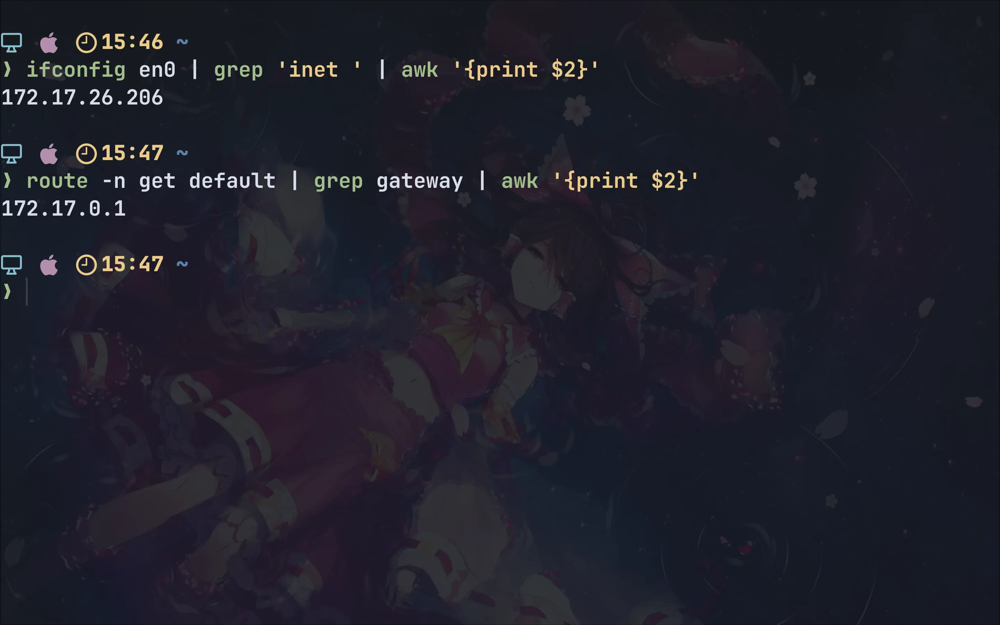

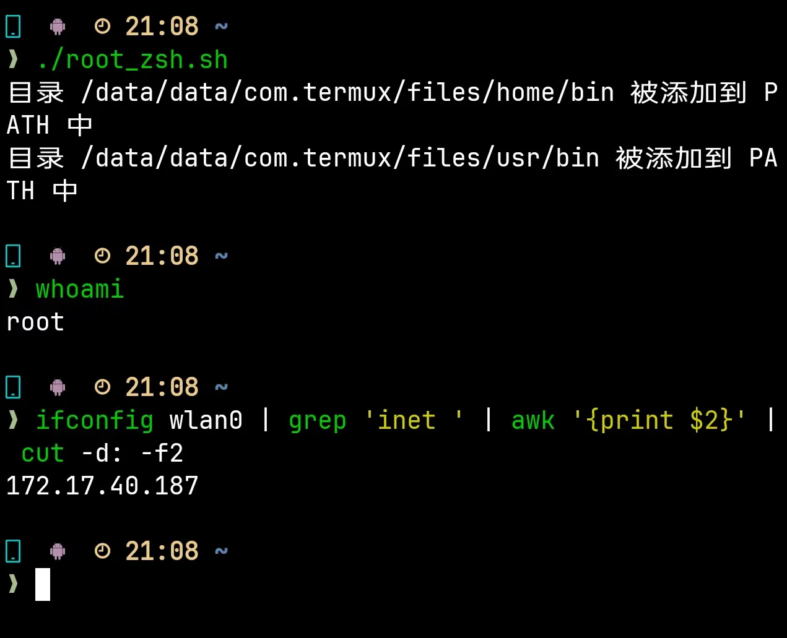

此处可以看到：
- 电脑的 IP 地址为 `172.17.54.68`
- 网关地址为 `172.17.0.1`
- 手机的 IP 地址为 `172.17.40.187`

教学楼的网段为 `172.17.0.0/18`，子网掩码为 `255.255.192.0`。进行与运算可知：
- `172.17.54.68 & 255.255.192.0 = 172.17.0.0`
- `172.17.40.187 & 255.255.192.0 = 172.17.0.0`

因此两台设备处于同一子网内，理论上可以直接通过 IP 地址进行通信。

#### 1.3.2. 初步测试：无法 ping 通

在电脑上执行 `ping -c 3 172.17.40.187`，发现无法连通；在手机上执行 `ping -c 3 172.17.54.68`，同样无法连通。并且双方的抓包结果表明双方都没有收到对方的包。

#### 1.3.3. 推测

根据上述实验结果与一些资料的收集，推测校园网可能通过 **AP（Access Point，接入点）隔离**机制来限制。

在无线网络中，AP 通常起到把无线终端接入有线网络的作用，同时也可以负责数据的收发、转发。

在默认情况下，如果多个终端连接到同一个 AP，它们之间可以直接通过二层转发进行通信。例如，两台接入同一 Wi-Fi 的电脑之间，可以不经过外网网关直接互相传输文件。

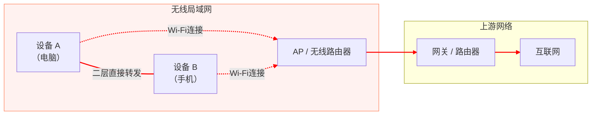

然而，校园网或公共 Wi-Fi 场景中，往往会启用 AP 隔离机制。其作用是：
- 防止恶意用户在局域网内进行端口扫描、中间人攻击等行为。
- 防止被感染的设备在局域网内传播病毒。
- 减少不必要的局域网通信，提高管理员对网络流量的监控与控制能力。

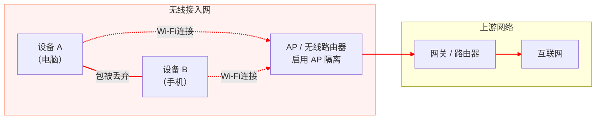
  
因此，从实验结果推测，即便电脑和手机处于同一网段，由于 AP 隔离的存在，它们的数据包会被 AP 丢弃或阻断，导致无法直接互通。

换句话说，只要流量从二层变成三层（跨网段）路由，AP 隔离就失效，因为 AP 不会阻止正常路由转发。

如果可以让请求包沿着 `A -> AP -> GW -> AP -> B`，响应包沿着 `B -> AP -> GW -> AP -> A` 路径传输，那么就能实现设备间的通信。

[参考文章 1：Windows 下 AP 隔离的解决方案](https://blog.csdn.net/qq_25177949/article/details/143834903)

[参考文章 2：Linux 下 AP 隔离的解决方案](https://www.cnblogs.com/wangbingbing/p/17931315.html)

:spoiler[那本文算不算弥补了没有 macOS 和 Android 的 AP 隔离解决方案呢？~~好吧其实和 Linux 基本上一样~~]

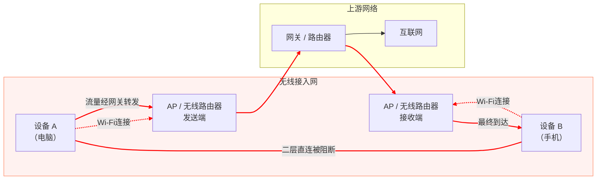

#### 1.3.4. 尝试解决：电脑到手机

首先，确认电脑和手机与网关之间的连通性。

在电脑上执行 `ping -c 3 172.17.0.1`，发现可以连通；在手机上执行 `ping -c 3 172.17.0.1`，同样可以连通。

其次，通过设置路由规则，让电脑和手机之间的流量先经过网关转发。

由于每次连接 Wi-Fi 时，路由表中就会被添加上子网间直连的路由规则，并且占据优先级较高，因此需要先删除原先的子网通信规则。然后再添加与对方通信经过网关的路由规则。

:::important
因为我已经安装了 `iproute2mac`，所以我用的是 `ip route` 风格的命令，如果是实际 macOS 操作应该用 `route` 命令。

如果出了问题导致无法上网也很好恢复，只需要断开 Wi-Fi 再重新连接即可。
:::

在 macOS 电脑上执行以下命令：

```bash
sudo ip route del 172.17.0.0/18
sudo ip route add 172.17.40.187 via 172.17.0.1 dev en0
```

成功移除默认子网路由并添加网关中继路由后，在电脑上重新 `ping -c 3 172.17.40.187`，发现手机已经可以收到包：

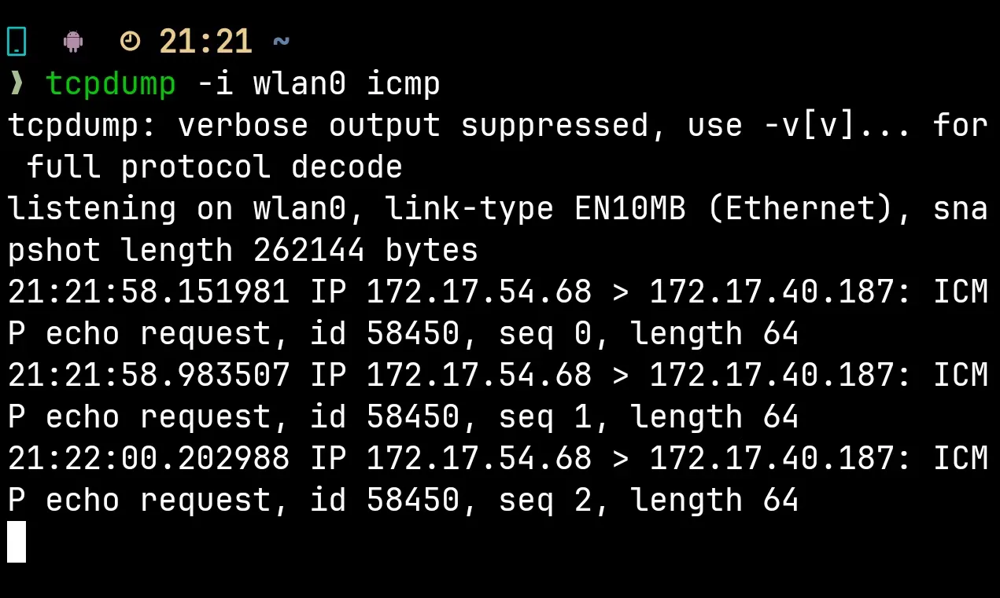

当然电脑 `ping` 手机仍然是超时（因为响应包无法回来）。

#### 1.3.5. 尝试解决：手机到电脑

尽管单向通信已经足够解决发送文件的问题了，但是显然极度繁琐，即使写成脚本，也不如直接双向通信方便。

那么接下来解决双向通信的问题。

在手机上执行以下命令（需要 `root` 权限）：

```bash
ip route del 172.17.0.0/18 dev wlan0
ip route add 172.17.54.68 via 172.17.0.1 dev wlan0
```

首先，进行 `ping` 的测试，在手机上执行 `ping 172.17.54.68`，发现可以连通。

其次，进行 `ssh` 的测试，在手机上执行 `ssh`，发现可以连通：

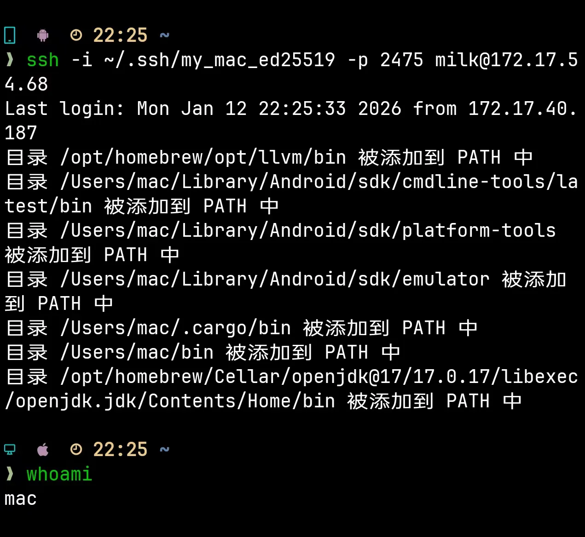

既然 `ssh` 已经可以连通，那么 `rsync` 也应该可以连通，因此这里就不进行测试了。:spoiler[~~那当然是因为无需测试而不是因为我当时忘记测试了啦。~~]

#### 1.3.6. 在单向连通的情况下发送包

实际上，在单向连通的情况下，理论上已经可以单向发送文件了，但是由于没有 TCP 带来的可靠数据传输，我们需要为数据添加冗余，以便另一端在接收到有误或者乱序的包后可以恢复文件，而 `zfec` 提供了这个功能：把文件拆成 k 份原始数据块并添加冗余，总共 n 个块中，只要收到任意 k 个，接收端就可以恢复这个包。

首先，发送方把文件用 `zfec` 拆分：

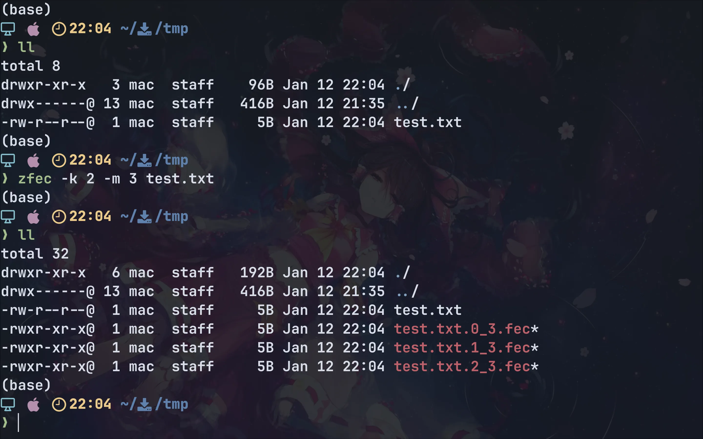

接收端使用 `nc -u -l -p [接收方端口号] > [文件名]` 准备接收：

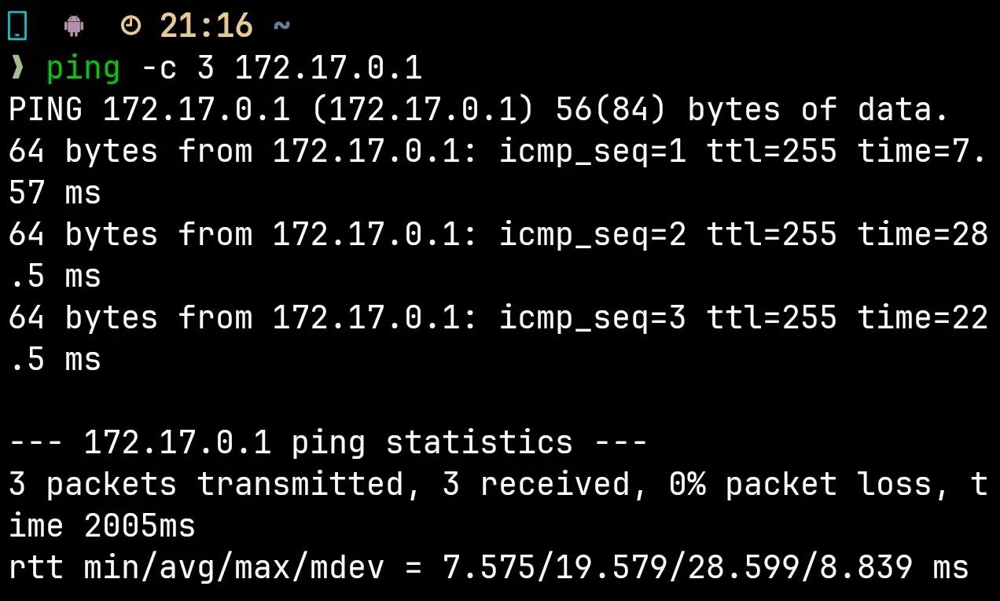

发送端使用 `nc -u [接收方 IP] [接收方端口号] < [文件名]` 命令将文件直接发送到接收方：

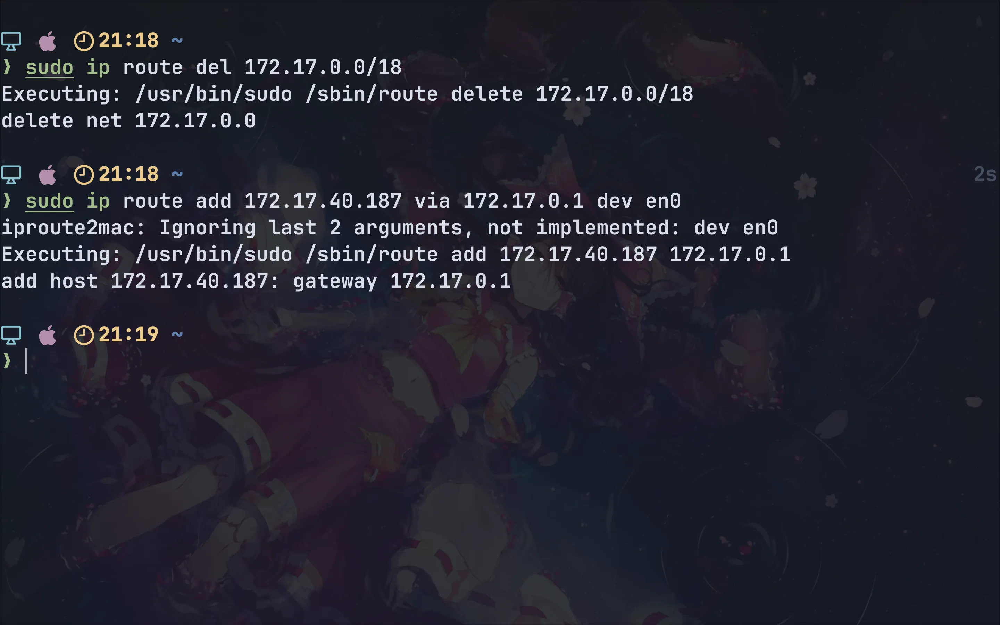

接收方恢复文件：

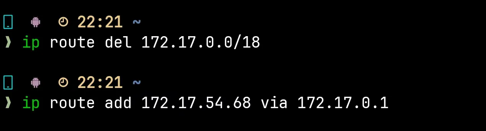

:::note
1. 每次发送单个块、接收单个块，发送前接收端必须准备好。
2. 由于发送大的块的时候，可能会被分片，此时包如果乱序到达可能导致无法恢复。

要么使用基于 UDP 并实现了排序的协议，要么就切分的足够多，直到每个块的大小可以在一个包内发送。
:::

## 2. 第二部分

### 2.1. 后续

#### 2.1.1. 奇怪的非对称性

读完第一部分你是不是觉得这个问题已经完全解决了呢？其实不然，当时的实验中，**只有我的手机能 `ping` 通电脑，而我的电脑却不能 `ping` 通手机**！这就很奇怪了，既然手机能够 `ping` 通电脑，那就说明手机发送给电脑的包和电脑发送给手机的包都能正常到达对方，那么为什么电脑却不能 `ping` 通手机呢？

于是我决定：在电脑 `ping` 手机的同时，在手机上通过 `tcpdump` 进行抓包，看看电脑发送的包是否能够到达手机。

在电脑上执行 `ping -c 3 172.17.40.187`，发现无法连通，仍然是超时。

在手机上执行 `tcpdump` 进行抓包：

```bash
tcpdump -i wlan0 icmp and host 172.17.54.68 -n -vvv -e
```


观察结果，发现手机已经收到了电脑发送的 ICMP 请求包，但是手机没有发送 ICMP 响应包。

#### 2.1.2. 原因分析

`ping` 前查看手机的 `iptables`：

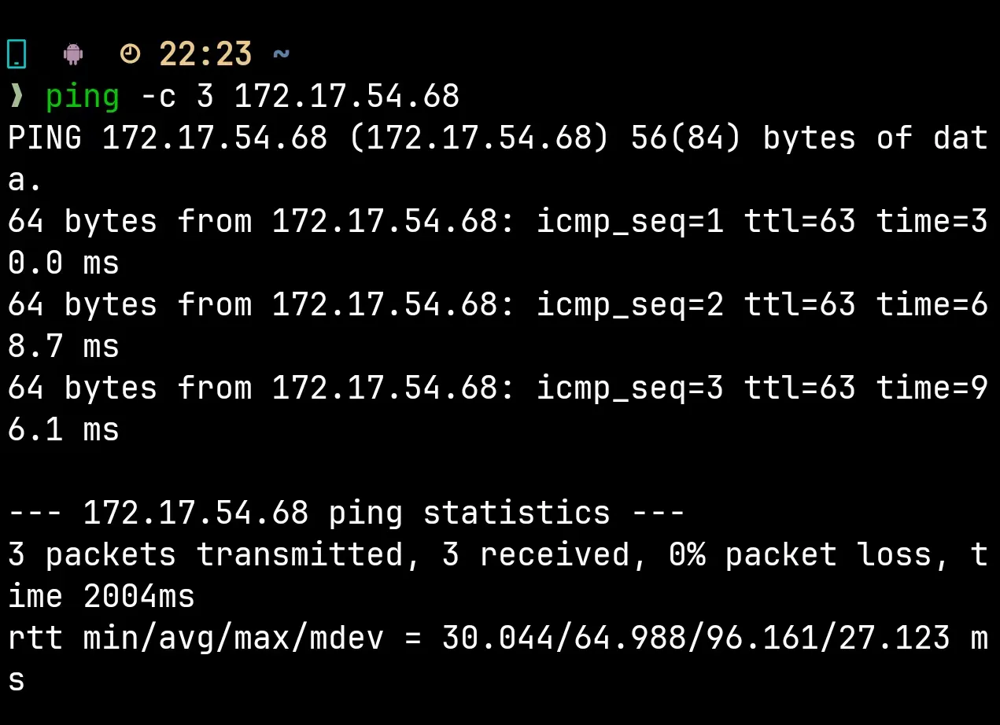

执行顺序以及计数器：

```bash
Chain OUTPUT (policy ACCEPT)
1  50794  customize_OUTPUT
2  50794  RESTRICTION_SSDP_CHAIN
3  50794  oem_out
4  50794  fw_OUTPUT
5  50530  st_OUTPUT
6  50530  bw_OUTPUT
7  45777  match bpf pinned /sys/fs/bpf/prog_oplus-netd_skfilter_egress_wakeup   (TCP)
8  3775   match bpf pinned /sys/fs/bpf/prog_oplus-netd_skfilter_egress_sliceudp (UDP)
```

`ping` 后查看手机的 `iptables`：

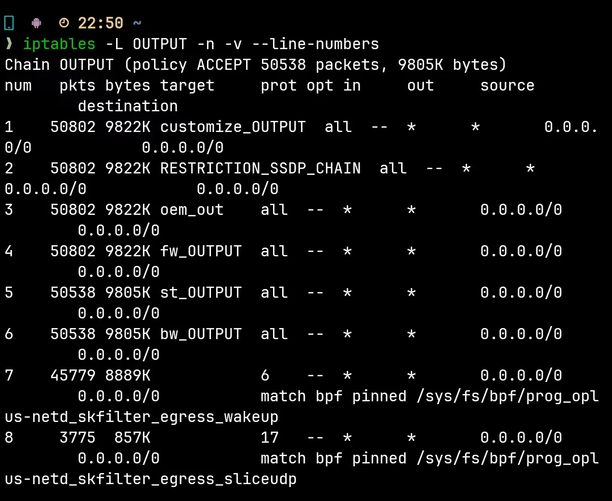

执行顺序以及计数器以及变化量：

```bash
Chain OUTPUT (policy ACCEPT)
1  50802  8   customize_OUTPUT
2  50802  8   RESTRICTION_SSDP_CHAIN
3  50820  8   oem_out
4  50802  8   fw_OUTPUT
5  50538  8   st_OUTPUT
6  50538  8   bw_OUTPUT
7  45779  2   match bpf pinned /sys/fs/bpf/prog_oplus-netd_skfilter_egress_wakeup   (TCP)
8  3775   0   match bpf pinned /sys/fs/bpf/prog_oplus-netd_skfilter_egress_sliceudp (UDP)
```

说明确实有包尝试通过链？

在本地回环接口抓包：

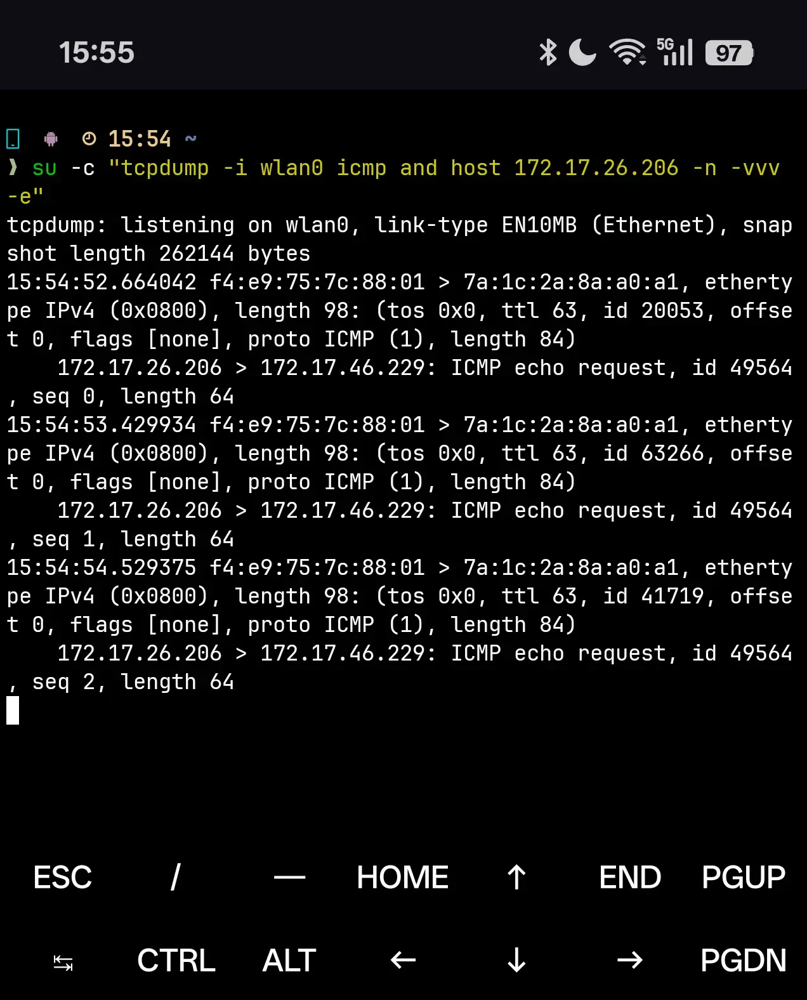

发现返回了 `Host Unreachable`？可是路由表内已经有了条目了...之前手机 `ping` 的时候也说明其实是可以抵达的？

:::important
如果有大佬知道是怎么回事的话，请务必告知我！感激不尽！！！我的邮箱：mrk2715093695@gmail.com
:::

:::note
（后续实验补充）后续借用电脑实现 Windows 与 macOS 的局域网双向连通成功，因此问题几乎锁定在了 Android 网络栈的实现或是防火墙上。
:::

#### 2.1.3. 绕过问题实现双向通信

既然手机和电脑已经建立了 ssh 连接，事实上双方都已经可以向对方发送包，因此，只要让电脑向手机的 ssh 连接被这条 ssh 连接包裹住，就可以实现反向的连接了，这种技术就是 ssh 反向隧道。

首先，在手机建立 ssh 反向隧道，将手机的 ssh 端口（8022）映射到电脑的 4683 端口（随便选的）：

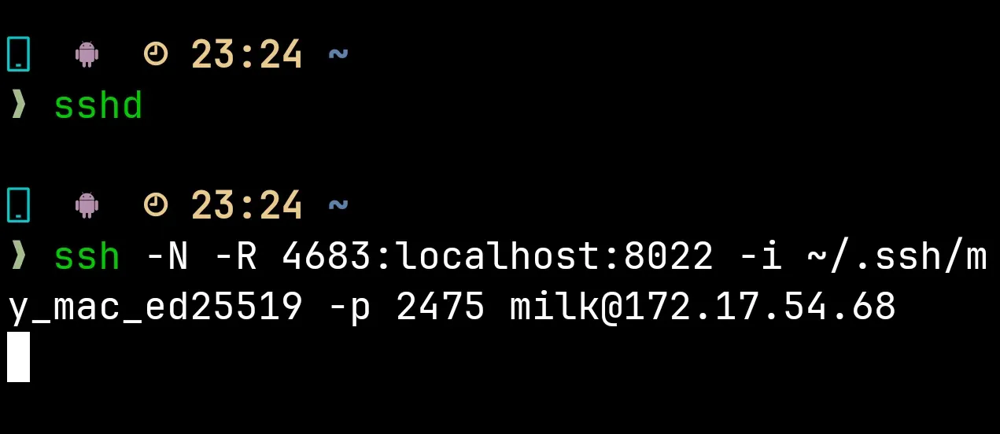

其次，在电脑连接 localhost:4683 即可：

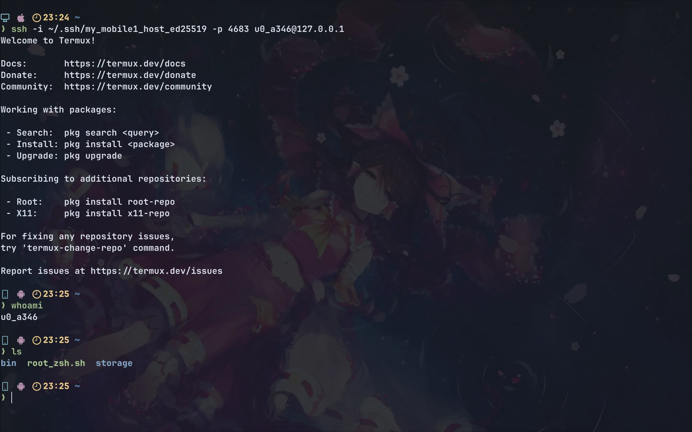

### 2.2. 宿舍网段

下次有空继续写。

## 参考文献

1. 我叫czc. 【windows】校园网AP隔离解决方案笔记-解决校内设备之间无法互相通信的臭毛病-附破解程序[J/OL]. CSDN, 2024-11-21. [在线访问](https://blog.csdn.net/qq_25177949/article/details/143834903)
2. 王冰冰. AP隔离的设备互相访问[J/OL]. 博客园, 2023-12-27. [在线访问](https://www.cnblogs.com/wangbingbing/p/17931315.html)

> 参考文献使用 **CC BY-SA 4.0** 协议授权。按照该协议，本文同样遵循 CC BY-SA 4.0 许可，允许商业或非商业用途的共享与再创作，但必须保留原作者署名，并以相同协议方式进行再发布。
