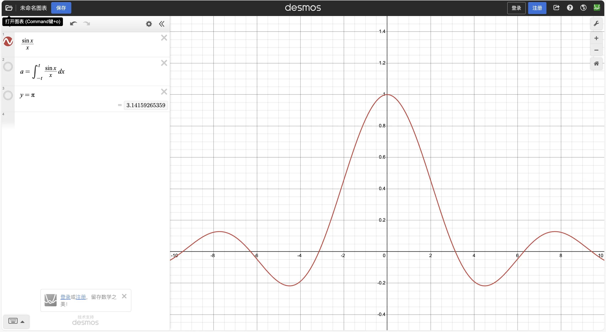
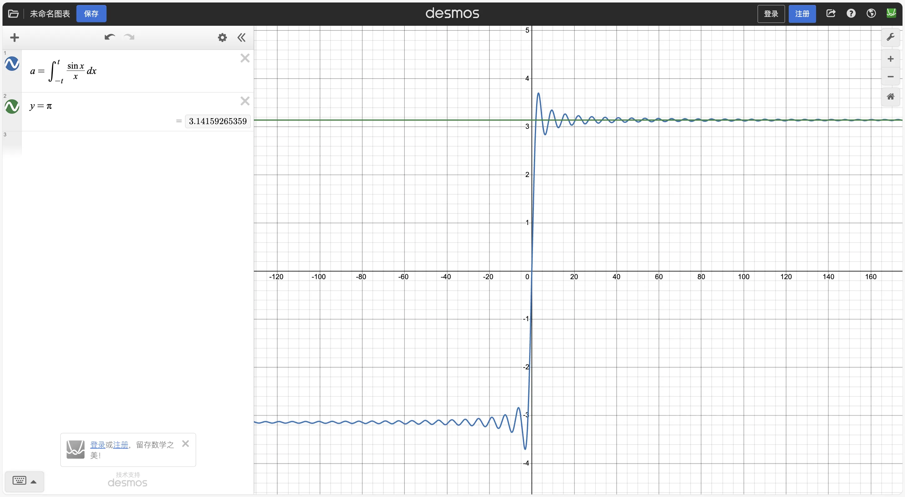
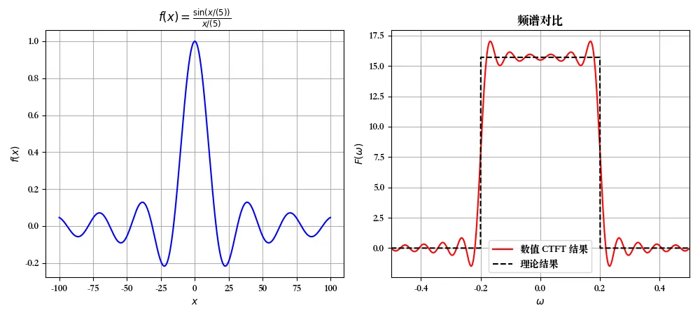
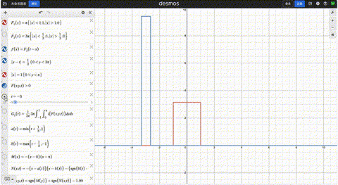
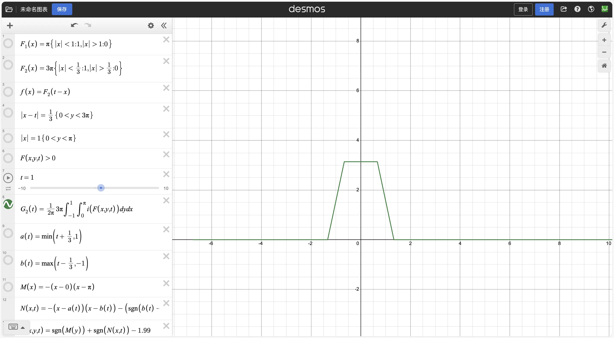
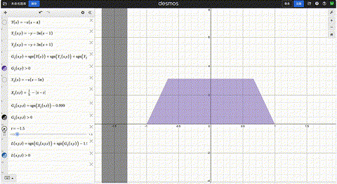
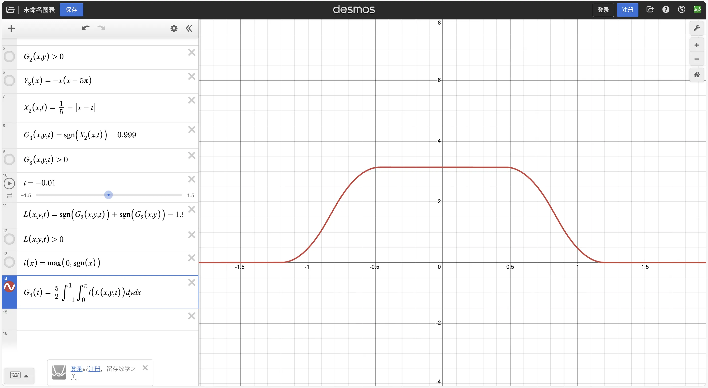

:::note
本文仍在写作中。
:::

:::tip
本文是 [关于数学的一些有趣讨论（一：圆周率）](https://milk2715093695.github.io/posts/math-discussion-i/) 的续篇，主要讨论数学中的反直觉现象。
:::

关于数学中反直觉现象的探讨，同样来自于之前的这个话题。

当时我正在向其他人科普第一部分中所述的内容，当然也收到了一些反驳。对于这种需要严谨性的场合，我并不讨厌反驳。但是，很多人在反驳的时候，不是靠眼睛的推导，而是依赖于自己的直觉。直觉在日常生活中非常有效，但在数学的抽象世界里，它却有时会误导我们。例如，直觉可能会让人认为某些看似简单的命题必然成立，或者认为某些极端情况不可能发生，但严格证明往往显示结果完全相反。以下我会举几个例子（尽管未必和 $\pi$ 有关）。

## 目录

- [目录](#目录)
- [1. Borwein 积分](#1-borwein-积分)
  - [1.1. I1](#11-i1)
  - [1.2. 其他 I 的值](#12-其他-i-的值)
  - [1.3. 规律？](#13-规律)
  - [1.4. 解释](#14-解释)
- [2. 下次再写](#2-下次再写)
- [附录](#附录)
  - [附录 A. 绘制傅立叶变换的 Python 代码](#附录-a-绘制傅立叶变换的-python-代码)

## 1. Borwein 积分

这个相关的内容，其实 3blue1brown（[Youtube](https://www.youtube.com/@3blue1brown)、[Bilibili](https://space.bilibili.com/88461692)）已经讲的很明白了，所以我写这部分主要是验证自己的学习情况，详情可以参考这个视频：

<iframe width="100%" height="468" src="//player.bilibili.com/player.html?bvid=BV18e4y1u7BH&p=1&autoplay=0" scrolling="no" border="0" frameborder="no" framespacing="0" allowfullscreen="true" &autoplay=0> </iframe>

**强烈推荐 3Blue1Brown，他的科普清晰明了，可视化也很好。**

Borwein 积分是指：

$$
I_n = \int_{-\infty}^{\infty} \prod\limits_{k=1}^n \frac{\sin(\frac{x}{2k-1})}{\frac{x}{2k-1}} \, dx
$$

:::note
准确来说，积分上下限带有 $\pm \infty$ 的反常积分上下限应该用 $\lim_{a \to \infty}$ 来表示，但为了方便，我们直接用 $\infty$。这一点不严谨我们暂时忽略。
:::

### 1.1. I1

首先，我们来看 $I_1$：

$$
I_1 = \int_{-\infty}^{\infty} \frac{\sin x}{x} \, dx
$$





我们先用**初等方法**（这里指的是不使用高级工具）来推导这个积分，用作微积分练习题。:spoiler[同时也留个悬念，否则容易直接看出来。]

注意到，$\frac{\sin x}{x}$ 是一个偶函数，所以：

$$
I_1 = 2 \int_{0}^{\infty} \frac{\sin x}{x} \, dx
$$

定义：

$$
\begin{aligned}
    I(\alpha) &= \int_{0}^{\infty} \frac{\sin x}{x} e^{-\alpha x} \, dx \\
    &= \int_{0}^{\infty} \frac{\sin x - \sin(0)}{x} e^{-\alpha x} \, dx \\
    &= \int_{0}^{\infty} \int_0^1 \cos(tx) \, dt \, e^{-\alpha x} \, dx \\
    &= \int_0^1 \int_{0}^{\infty} \cos(tx) e^{-\alpha x} \, dx \, dt
\end{aligned}
$$

接下来，就是经典的分部积分，令：

$$
\begin{aligned}
    J &= \int \cos(tx) e^{-\alpha x} \, dx \\
    &= - \frac{1}{\alpha} \int \cos(tx) \, de^{-\alpha x} \\
    &= - \frac{1}{\alpha} \left[ \cos(tx) e^{-\alpha x} - \int e^{-\alpha x}  \cos(tx) \right] \\
    &= - \frac{1}{\alpha} \left[ \cos(tx) e^{-\alpha x} + t \int \sin(tx) e^{-\alpha x} \, dx \right] \\
\end{aligned}
$$

同样，令：

$$
\begin{aligned}
    K &= \int \sin(tx) e^{-\alpha x} \, dx \\
    &= - \frac{1}{\alpha} \int \sin(tx) \, de^{-\alpha x} \\
    &= - \frac{1}{\alpha} \left[ \sin(tx) e^{-\alpha x} - \int e^{-\alpha x}  \sin(tx) \right] \\
    &= - \frac{1}{\alpha} \left[ \sin(tx) e^{-\alpha x} - t \int \cos(tx) e^{-\alpha x} \, dx \right] \\
\end{aligned}
$$

于是有：

$$
J = - \frac{1}{\alpha} \left[ \cos(tx) e^{-\alpha x} + \frac{t}{\alpha} \left( \sin(tx) e^{-\alpha x} + t J \right) \right]
$$

解得：

$$
J = \frac{-t \sin(tx) e^{-\alpha x} - \alpha \cos(tx) e^{-\alpha x}}{\alpha^2 + t^2}
$$

代入上下限：

$$
\int_{0}^{\infty} \cos(tx) e^{-\alpha x} \, dx = \frac{\alpha}{\alpha^2 + t^2}
$$

回代：
$$
\begin{aligned}
    I(\alpha) &= \int_0^1 \int_{0}^{\infty} \cos(tx) e^{-\alpha x} \, dx \, dt \\
    &= \int_0^1 \frac{\alpha}{\alpha^2 + t^2} \, dt \\
    &= \arctan(\frac{1}{\alpha})
\end{aligned}
$$

取极限 $\lim_{\alpha \to 0} I(\alpha)$：

$$
\lim_{\alpha \to 0} I(\alpha) = \frac{\pi}{2}
$$

所以：

$$
I_1 = 2 \int_{0}^{\infty} \frac{\sin x}{x} \, dx = \pi
$$

这就是著名的 Dirichlet 积分。

### 1.2. 其他 I 的值

总而言之，Borwein 积分的前面几项是：

$$
\begin{cases}
    I_1 = \int_{-\infty}^{\infty} \frac{\sin x}{x} \, dx = \pi \\
    I_2 = \int_{-\infty}^{\infty} \frac{\sin x}{x} \frac{\sin(x/3)}{x/3} \, dx = \pi \\
    I_3 = \int_{-\infty}^{\infty} \frac{\sin x}{x} \frac{\sin(x/3)}{x/3} \frac{\sin(x/5)}{x/5} \, dx = \pi \\
    \cdots \\
    I_7 = \pi
\end{cases}
$$

### 1.3. 规律？

看到这里，你是否认为你发现了一个伟大的规律：

$$
I_n = \int_{-\infty}^{\infty} \prod\limits_{k=1}^n \frac{\sin(\frac{x}{2k-1})}{\frac{x}{2k-1}} \, dx = \pi
$$

然而，事实上，$I_8 \ne \pi$...

### 1.4. 解释

事实上，这和傅立叶变换有关。

$\frac{\sin(Wt)}{\pi t}$ 是一个著名的函数，被称为 \sinc 函数，经常被用来做理想滤波器，它的傅立叶变换是：

$$
\mathcal{F} \left\{ \frac{\sin(Wt)}{\pi t} \right\} = X(j \omega) = \begin{cases}
    1, & |\omega| < W \\
    0, & |\omega| > W
\end{cases}
$$

由傅立叶变换的线性性质，我们有：
$$
\mathcal{F} \left\{ \frac{\sin(\frac{x}{2k - 1})}{\frac{x}{2k-1}} \right\} = \begin{cases}
    (2k-1) \pi, & |\omega| < \frac{1}{2k-1} \\
    0, & |\omega| > \frac{1}{2k-1}
\end{cases}
$$



绘图代码见 [附录 A: 绘制傅立叶变换的 Python 代码](#附录-a-绘制傅立叶变换的-python-代码)。

令被积函数 $g_n(x) = \prod\limits_{k=1}^n \frac{\sin(\frac{x}{2k-1})}{\frac{x}{2k-1}}$，则 $g_1(x) = \frac{\sin x}{x}$，$g_{n + 1}(x) = g_n(x) \cdot \frac{\sin(\frac{x}{2n + 1})}{\frac{x}{2n + 1}}$。

傅立叶变换的乘积性质：

$$
\mathcal{F}\left\{ x(t) \cdot y(t) \right\} = \frac{1}{2 \pi} X(j \omega) * Y(j \omega)
$$

这里的 $*$ 表示卷积：$X(j \omega) * Y(j \omega) = \int_{-\infty}^{\infty} X(j (\omega - \theta)) Y(j \theta) \, d\theta$。

令 $\mathcal{F} \left\{ g_n(x) \right\} = G_n(j \omega)$，于是：

$$
G_{n+1}(j \omega) = \frac{1}{2 \pi} \cdot G_n(j \omega) * \mathcal{F} \left\{ \frac{\sin(\frac{x}{2n + 1})}{\frac{x}{2n + 1}} \right\}
$$

用以下示意图让人更容易理解（卷积结果在 $t$ 的取值和图中阴影面积成正比）：



可以明显看到，卷积结果在两个方形区域充分重叠的时候始终保持不变。



对于这一次卷积，这个不变的值就是 $r_{2} = \frac{1}{2\pi} \cdot \pi \cdot 3\pi \cdot \frac{2}{3} = \pi$。而这个值保持不变的区间长度（由于对称性，只考虑大于 0 的部分）就是 $l_{2} = 1 - \frac{1}{3} = \frac{2}{3}$。





如果继续进行卷积，上一次不变的值是 $r_{n} = \pi$，那么下一次就是 $r_{n+1} = \frac{1}{2\pi} \cdot \pi \cdot (2n + 1)\pi \frac{2}{2n + 1} = \pi$，而区间长度是 $l_{n+1} = l_n - \frac{1}{2n + 1}$，
所以只要 $l_n > 0$，$r_n$ 就一定是 $\pi$，而 $l_n < 0$ 时，不存在一个保持不变的区间。

另外注意到一件事：无论这个不变区间多长，$0$ 总是在这个区间内，所以，只要 $l_n > 0$，$G_{n+1}(0) = \pi$。

而傅立叶变换的表达式：

$$
X(j \omega) = \int_{-\infty}^{\infty} x(t) e^{-j \omega t} \, dt
$$

代入 $0$ 就会发现，$X(0) = \int_{-\infty}^{\infty} x(t) \, dt$，也就是原函数的积分，也就是 $I_n$。

也就是说，我们得到了结论：只要 $l_n > 0$，$I_n = \pi$。

下面列出 $l_n$ 的值：

| $i$ | 递推计算式                      |  $l_i$  |
| :-: | :------------------------- | :-------: |
|  1  | 已知                         |  $1.000000$ |
|  2  | $1 - \frac{1}{3}$          |  $0.666667$ |
|  3  | $0.666667 - \frac{1}{5}$   |  $0.466667$ |
|  4  | $0.466667 - \frac{1}{7}$   |  $0.323810$ |
|  5  | $0.323810 - \frac{1}{9}$   |  $0.212699$ |
|  6  | $0.212699 - \frac{1}{11}$  |  $0.121790$ |
|  7  | $0.121790 - \frac{1}{13}$  |  $0.045998$ |
|  8  | $0.045998 - \frac{1}{15}$  | $-0.020669$ |

正好在 $I_8$ 时，$0.045998 - \frac{1}{15} < 0$，所以 $I_8 \ne \pi$，而 $I_1, I_2, \dots, I_7 = \pi$！

## 2. 下次再写

## 附录

### 附录 A. 绘制傅立叶变换的 Python 代码

```python
import matplotlib.pyplot as plt
import numpy as np

# macOS 可用字体
plt.rcParams["font.sans-serif"] = ["Songti SC"]  # 显示中文

# Windows 可用字体
# plt.rcParams['font.sans-serif'] = ['SimHei']    # 显示中文

plt.rcParams["axes.unicode_minus"] = False  # 显示负号


# 参数
k = 3
W = 1 / (2 * k - 1)
n = 40000
x_max = 100
x = np.linspace(-x_max, x_max, n)
dx = x[1] - x[0]

# 连续函数
y = np.sinc(x / np.pi / (2 * k - 1))

# 数值近似 CTFT
omega = np.linspace(-1, 1, 2000)
F = np.array([np.sum(y * np.exp(-1j * w * x)) * dx for w in omega])

# 理论矩形谱
theory = np.zeros_like(omega)
theory[np.abs(omega) < W] = (2 * k - 1) * np.pi

# 绘图
plt.figure(figsize=(10, 4.5))

# 时域
plt.subplot(1, 2, 1)
plt.plot(x, y, "b")
plt.title(rf"$f(x)=\frac{{\sin(x/({2*k-1}))}}{{x/({2*k-1})}}$")
plt.xlabel("$x$")
plt.ylabel("$f(x)$")
plt.grid(True)

# 频域
plt.subplot(1, 2, 2)
plt.plot(omega, np.real(F), "r", label="数值 CTFT 结果")
plt.plot(omega, theory, "k--", label="理论结果")
plt.title("频谱对比")
plt.xlabel("$\\omega$")
plt.ylabel("$F(\\omega)$")
plt.xlim(-0.5, 0.5)
plt.legend()
plt.grid(True)

plt.tight_layout()
plt.show()
```
