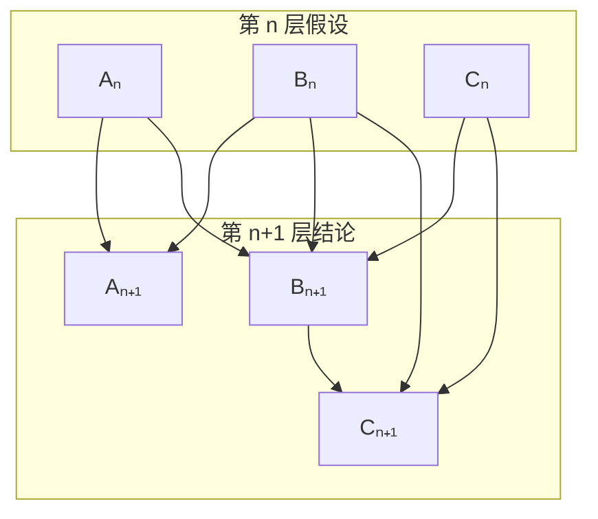

令 $\{ a_n \}_{n \ge 1}$ 为正整数数列，满足 $a_1 = 1$，记 $S_n = \sum\limits_{k=1}^n a_k$，$A_n = \{ a_1, a_2, \dots, a_n \}$。对于 $n \ge 2$，$a_n$ 为满足以下条件的最小正整数：

1. $a_n \notin A_{n-1}$
2. $n \mid (S_{n-1} + a_n)$

~~☝️🤓注意力惊人的读者不难发现这个其实就是 [OCIS 的 A01944](https://oeis.org/A019444)。~~

证明或推翻：$a_i = j \Leftrightarrow a_j = i$。

## 目录

- [目录](#目录)
- [题目背景](#题目背景)
- [1. 观察](#1-观察)
- [2. 编程验证](#2-编程验证)
- [3. 证明](#3-证明)
  - [3.1. 转化](#31-转化)
  - [3.2. 另一个数列](#32-另一个数列)
    - [3.2.1. αn 的性质](#321-αn-的性质)
  - [3.3. 引理 1：原数列的相关性质](#33-引理-1原数列的相关性质)
  - [3.4. 一些性质](#34-一些性质)
    - [3.4.1. 性质 1：不存在三项连续不变的 h(n)](#341-性质-1不存在三项连续不变的-hn)
    - [3.4.2. 性质 2：h(n) 的增长滞后性](#342-性质-2hn-的增长滞后性)
    - [3.4.3. 性质 3：h(n) 的下界保持性](#343-性质-3hn-的下界保持性)
    - [3.4.4. 性质 4：h(n) 会遍历正整数集](#344-性质-4hn-会遍历正整数集)
    - [3.4.5. 性质 5：f(n) 是对正整数集的全排列](#345-性质-5fn-是对正整数集的全排列)
    - [3.4.6. 性质 6：不存在 f(k) = f(k - 1) + 1](#346-性质-6不存在-fk--fk---1--1)
  - [3.5. 观察原数列更深刻的性质](#35-观察原数列更深刻的性质)
    - [3.5.1. 观察一：h(n) 的嵌套](#351-观察一hn-的嵌套)
    - [3.5.2. 观察二](#352-观察二)
    - [3.5.3. 对于观察到性质的简单总结](#353-对于观察到性质的简单总结)
  - [3.6. 证明 f(f(n)) = n](#36-证明-ffn--n)
    - [3.6.1. 证明的第一部分](#361-证明的第一部分)
    - [3.6.2. 证明的第二部分](#362-证明的第二部分)
    - [3.6.3. 证明的第三部分](#363-证明的第三部分)
- [附录](#附录)
  - [附录 A. 计算数列前 n 项的 Python 代码](#附录-a-计算数列前-n-项的-python-代码)
  - [附录 B. 验证 h(h(n)) + h(n + 1) = n + 2 的 Python 代码](#附录-b-验证-hhn--hn--1--n--2-的-python-代码)
  - [附录 C. 验证 h(h(n) + n) = n + 1 的 Python 代码](#附录-c-验证-hhn--n--n--1-的-python-代码)
- [参考文献](#参考文献)

## 题目背景

这道题是我在 B 站视频 [【数学杂谈】为什么我不做野题](https://www.bilibili.com/video/BV1DiNxzHE1T) 的评论区看到的，是这位网友在学习数学竞赛期间自己想到的题目，因此不知道命题的真伪。

评论原文：
> 说到野题，我想起本高中生搞数竞时yy出的题：数列满足a1=1，an为满足Sn可被n整除且不在前n-1项出现的最小正整数，证明ai=j等价于aj=i，有没有懂的大佬看一下这个问题。

## 1. 观察

首先列出这个数列的前几项：

| $n$ | $a_n$ | $S_n = \sum\limits_{k=1}^n a_k$ |
| :-: | :---: | :-----------------------------: |
|  1  |   1   |                1                |
|  2  |   3   |                4                |
|  3  |   2   |                6                |
|  4  |   6   |                12               |
|  5  |   8   |                20               |
|  6  |   4   |                24               |
|  7  |   11  |                35               |
|  8  |   5   |                40               |
|  9  |   14  |                54               |
|  10 |   16  |                70               |

在表格中看起来似乎 $a_i = j$ 与 $a_j = i$ 是等价的。

## 2. 编程验证

这个时候我还不是很确定这个命题到底是真是假，所以决定通过代码先验证以下前面若干项是否成立（算法并不高效，但是已经够用了）：

[附录 A. 计算数列前 n 项的 Python 代码](#附录-a-计算数列前-n-项的-python-代码)

经过验证，在前 10000 项中，命题成立，这个时候就比较确信这个命题是正确的了。

## 3. 证明

:::important
本文证明的整体思路来源于 Venkatachala, B. J., *A Curious Bijection on Natural Numbers*, Journal of Integer Sequences, Vol 12 (2009)。  

文章中的文字、图片和代码均为作者原创，并使用 **CC BY-NC-SA 4.0** 协议。虽然证明思路参考自论文，但所有表达、整理和绘图均为作者独立完成。
:::

### 3.1. 转化

首先，为了方便之后的证明，我们用函数表示数列，例如，定义 $f(n) = a_n, n \in \mathbb{N}^+$，这是因为下标表示如果发生嵌套会导致可读性很差

### 3.2. 另一个数列

先抛开这个要证明的数列不谈，看看另一个数列。

:spoiler[~~不要问这个数列怎么想到的，因为我也不知道。~~]

定义：

$\alpha_1 = 1$，$n_k = \frac{\sum\limits_{i=1}^k \alpha_i}{k}$，$\Alpha_i = \{ \alpha_1, \alpha_2, \dots, \alpha_i \}$，有：

$$
\alpha_{k+1} = \begin{cases}
    n_k, & \text{若 } n_k \notin \Alpha_k \\
    n_k + k + 1, & \text{若 } n_k \in \Alpha_k
\end{cases}
$$

同样的，我们也列出这个数列的前 10 项：

| $k$ | $\alpha_k$ | $S_k = \sum\limits_{i=1}^{k} \alpha_i$ | $n_k = \frac{S_k}{k}$ |
| :-: | :---: | :------------------------: | :-----------: |
|  1  |   1   |              1             |       1       |
|  2  |   3   |              4             |      2       |
|  3  |   2   |              6             |       2       |
|  4  |   6   |             12             |      3       |
|  5  |   8   |             20             |       4       |
|  6  |   4   |             24             |      4       |
|  7  |   11  |             35             |       5       |
|  8  |   5   |             40             |      5       |
|  9  |   14  |             54             |       6       |
|  10 |   16  |             70             |      7       |

可以明显感觉到，$a_n$ 大概率和 $\alpha_n$ 是等价的。

定义 $g(k) = \alpha_k$，$h(k) = n_k$。

#### 3.2.1. αn 的性质

不难发现，$h(n)$ 总是一个正整数，以下用归纳法证明：

$n = 1$ 的情景显然成立。

$$
\begin{aligned}
h(m + 1) &= \frac{m \cdot h(m) + g(m + 1)}{m + 1} \\
&= \begin{cases}
    h(m), & \text{若 } h(m) \notin \Alpha_m \\
    h(m) + 1, & \text{若 } h(m) \in \Alpha_m
\end{cases} \\
&\in \mathbb{N}^+
\end{aligned}
$$

那么由数学归纳法，$h(n)$ 总是一个正整数。

在这个简单的归纳中，不难发现其他几个性质：

1. $h(n)$ 是单调不减的
2. $h(n + 1) = \begin{cases}h(n), & \text{当且仅当 } g(n + 1) = h(n) \\ h(n) + 1, & \text{当且仅当 } g(n + 1) = h(n) + n + 1 \end{cases}$
3. $h(n) \le n$（这是因为 $h(n)$ 每次增加的不超过 $1$）

### 3.3. 引理 1：原数列的相关性质

考虑到一个看起来和原数列等价的数列具有这些性质，我们对原数列也进行证明，同样地，我们用 $f(n)$ 表示 $a_n$，用 $h(n)$ 表示 $\frac{S_n}{n}$。

关于这里 $h(n)$ 重复使用的问题不必担心，**从现在开始，关于另一个数列的 $h(n)$ 的定义将被废止，此后的 $h(n)$ 均在原数列中定义**。

<br>

目标：归纳证明

1. $h(n)$ 是单调不减的
2. $h(n + 1) = \begin{cases}h(n), & \text{当且仅当 } f(n + 1) = h(n) \\ h(n) + 1, & \text{当且仅当 } f(n + 1) = h(n) + n + 1 \end{cases}$
3. $h(n) \le n$（这是因为 $h(n)$ 每次增加的不超过 $1$）

<br>

对于前几项的验证不再赘述，感兴趣的读者可以自行验证。

若三条性质对任意 $1 \le j \le n$ 成立，则当 $j = n + 1$ 时，有：

$n + 1 \mid n \cdot h(n) + f(n + 1)$

<br>

接下来做分类讨论：

1. $f(n + 1) < h(n)$
   
   因为有 $n + 1 \mid (n + 1) \cdot h(n)$ 成立
   
   那么 $n + 1 \mid (n + 1) \cdot h(n) - n \cdot h(n) - f(n + 1) = h(n) - f(n + 1)$
   
   又因为 $f(n + 1) < h(n)$，故 $h(n) \ge f(n + 1) + n + 1 \ge n + 1$，与归纳假设 $h(n) \le n$ 矛盾，故不成立。

2. $f(n + 1) \ge h(n)$

    1. $h(n) \notin \{ f(1), f(2), \dots, f(n) \}$

        因为当 $f(n + 1) = h(n)$ 时，有 $n + 1 \mid n \cdot h(n) + f(n + 1)$ 成立。

        而 $f(n + 1) \ge h(n)$，考虑到 $f(n + 1)$ 是最小的满足 $n + 1 \mid n \cdot h(n) + f(n + 1)$ 的正整数。
        
        所以有 $f(n + 1) = h(n)$。

    2. $h(n) \in \{ f(1), f(2), \dots, f(n) \}$

        反设 $h(n) + n + 1$ 已经被占用了，即 $\exists j \le n, \quad f(j) = h(n) + n + 1$。

        根据归纳假设我们知道，$f(j)$ 必然为 $h(j - 1)$ 和 $h(j - 1) + j$ 之一。

        1. $h(n) + n + 1 = f(j) = h(j - 1)$

            那么有 $h(n) = h(j - 1) - n - 1 \le j - 1 - n - 1 < 0$，这与 $f(n)$ 是正整数数列矛盾。

        2. $h(n) + n + 1 = f(j) = h(j - 1) + j$

            那么有 $h(n) - h(j - 1) = j - n - 1 < 0$，这与归纳假设中 $h(n)$ 单调不减矛盾。

        综上所述，反证假设不成立，那么 $h(n) + n + 1$ 并没有被占用。

        又因为 $f(n + 1) \ge h(n)$，且 $h(n)$ 已被占用，故 $f(n + 1) \ge h(n) + n + 1$。
    
        而 $f(n) = h(n) + n + 1$ 能让 $n + 1 \mid n \cdot h(n) + f(n + 1)$ 成立。

        故 $f(n + 1) = h(n) + n + 1$。

综上所述，当归纳假设成立时，$h(n + 1)$ 也成立。

根据数学归纳法，性质得证。

<br>

不难证明，$a_n$ 与 $\alpha_n$ 是等价的，即 $a_n = \alpha_n$。

### 3.4. 一些性质

:::important
这些里面的大部分性质在你看来可能不是那么自然，这是因为大部分性质都是因为后面的证明需要用到，才需要证明的。
:::

#### 3.4.1. 性质 1：不存在三项连续不变的 h(n)

反设：$\exists k, \quad h(k) = h(k + 1) = h(k + 2)$。

由 [引理 1](#33-引理-1原数列的相关性质)，$h(k + 2) = h(k + 1) \Leftarrow f(n + 2) = h(n + 1)$，故 $h(n + 1) \notin \{ f(1), f(2), \dots f(n + 1) \}$。

又因为 $h(n + 1) = h(n)$，故 $f(n + 1) = h(n) = h(n + 1)$，这与 $h(n + 1) \notin \{ f(1), f(2), \dots f(n + 1) \}$ 矛盾。

由此，反证假设不成立，故不存在三项连续不变的 $h(n)$。

#### 3.4.2. 性质 2：h(n) 的增长滞后性

性质 2：$\forall n \ge 6$，有 $h(n) + 2 \le n$。

由于 $h(n + 1) - h(n) \le 1$，且 $h(6) = 4$，故引理 3 显然成立。

#### 3.4.3. 性质 3：h(n) 的下界保持性

性质 3：$f(n + 1) > h(n) \Rightarrow \forall k \ge 1, \quad f(n + k) > h(n)$。

若 $f(n + 1) > h(n)$，由 [引理 1](#33-引理-1原数列的相关性质)，$f(n + 2) \ge h(n + 1) = \frac{n \cdot h(n) + f(n + 1)}{n + 1} > h(n)$。

而 $\forall k \ge 2, \quad f(n + k) \ge h(n + k - 1) \ge h(n + 1) > h(n)$，性质 3 得证。

#### 3.4.4. 性质 4：h(n) 会遍历正整数集

这是显然的，因为 $h(n + 1) - h(n) \le 1$，并且根据 [性质 1](#341-性质-1不存在三项连续不变的-hn)，$h(n)$ 的增长不会一直停滞。

#### 3.4.5. 性质 5：f(n) 是对正整数集的全排列

反设：$\exists m, m \notin \{ f(1), f(2), \dots \}$。

由 [性质 4](#344-性质-4hn-会遍历正整数集) 知，$\exists j, h(j) = m$，而 $m \notin \{ f(1), f(2), \dots, f(j - 1) \}$，那么根据 [引理 1](#33-引理-1原数列的相关性质)，$f(j + 1) = h(j) = m$，与反证假设矛盾。

故 $f(n)$ 是对正整数集的全排列。

#### 3.4.6. 性质 6：不存在 f(k) = f(k - 1) + 1

反设：$\exists k, \quad f(k) = f(k - 1) + 1$。

$S_k = k \cdot h(k) = S_{k-2} + f(k - 1) + f(k) = (k - 2) \cdot h(k - 2) + 2 f(k - 1) + 1$。

那么 $k \cdot (h(k) - h(k - 2)) = -2 h(k - 2) + 2 f(k - 1) + 1$。

由 [引理 1](#33-引理-1原数列的相关性质)，$h(k) - h(k - 2) = 1 \text{或 } 2$，根据奇偶性，$h(k) - h(k - 2) = 1$。

那么 $k = -2 h(k - 2) + 2 f(k - 1) + 1 = 2 (f(k - 1) - h(k - 2)) + 1 = 1 \text{或 } 2k - 1$，无论是哪一种都显然不成立。

故反证假设不成立，性质 6 得证。

### 3.5. 观察原数列更深刻的性质

考虑到我们最终要证明的命题：$f(f(n)) = n$，我们到现在为止所有性质暂时都还没有出现嵌套，因此，我们观察 $f(n)$ 和 $h(n)$ 的嵌套，意图找到一些有用的性质。

#### 3.5.1. 观察一：h(n) 的嵌套

| $i$  | $h(i)$ | $h(h(i))$ |
| -- | ---- | -------- |
| 1  | 1    | 1        |
| 2  | 2    | 2        |
| 3  | 2    | 2        |
| 4  | 3    | 2        |
| 5  | 4    | 3        |
| 6  | 4    | 3        |
| 7  | 5    | 4        |
| 8  | 5    | 4        |
| 9  | 6    | 4        |
| 10 | 7    | 5        |

注意到 $h(h(i)) + h(i + 1) = i + 2$ 有可能成立。

使用代码验证这一点：

[附录 B. 验证代码](#附录-b-验证-hhn--hn--1--n--2-的-python-代码)

至少对于前 10000 项，这个性质成立。

#### 3.5.2. 观察二

| $i$ | $h(i) + i$ | $h(h(i) + i)$ |
| --- | ---------- | ------------- |
| 1   | 2          | 2             |
| 2   | 4          | 3             |
| 3   | 5          | 4             |
| 4   | 7          | 5             |
| 5   | 9          | 6             |
| 6   | 10         | 7             |
| 7   | 12         | 8             |
| 8   | 13         | 9             |
| 9   | 15         | 10            |
| 10  | 17         | 11            |

注意到 $h(h(i) + i) = i + 1$ 有可能成立。

使用代码验证这一点：

[附录 C. 验证代码](#附录-c-验证-hhn--n--n--1-的-python-代码)

至少对于前 10000 项，这个性质成立。

#### 3.5.3. 对于观察到性质的简单总结

从观察结果来看，似乎有以下几条性质成立：

1. $h(h(i)) + h(i + 1) = i + 2$
2. $f(f(i)) = i$（我们要证明的目标）
3. $h(h(i) + i) = i + 1$

### 3.6. 证明 f(f(n)) = n

那么，我们同时证明这三条性质。

<br>

目标：归纳证明

1. $h(h(i)) + h(i + 1) = i + 2$
2. $f(f(i)) = i$
3. $h(h(i) + i) = i + 1$

<br>

对于前 10 项，刚才的观察已经证明了（其实前 10000 项都在代码中证明了），接下来只考虑 $n \ge 10$ 的情况

若三条性质对任意 $1 \leq i \leq n$ 成立，以下分别证明在 $i = n + 1$ 时三条性质仍然成立。

:::warning
以下内容涉及大量分类讨论，容易绕晕，请做好心理准备。
:::

先简要说明一下这次数学归纳法的思路：

1. 由在 $i \le n$ 时候成立的三条归纳假设，证明 $i = n + 1$ 时的第一条归纳假设。
2. 由在 $i \le n$ 时候成立的三条归纳假设，证明 $i = n + 1$ 时的第二条归纳假设。
3. 由在 $i \le n$ 时候成立的三条归纳假设，以及第二部分中，已经证明完成的 $i = n + 1$ 时的第二条归纳假设，证明 $i = n + 1$ 时的第三条归纳假设。


<div style="width: 40%; margin: auto;">
具体的证明脉络


</div>

最终，由数学归纳法，三条性质得证。我们的目标就是三条性质中的第二条。

#### 3.6.1. 证明的第一部分

这部分的目标是：证明 $h(h(n + 1)) + h(n + 2) = n + 3$。

1. Case A: $h(n + 1) = h(n)$

    根据 [性质 1：不存在三个连续不变的 h(n)](#341-性质-1不存在三项连续不变的-hn)，$h(n + 2) \neq h(n + 1)$，那么 $h(n + 2) = h(n + 1) + 1$。

    故 $h(h(n + 1)) + h(n + 2) = h(h(n)) + h(n + 1) + 1$。
    
    由 [归纳假设的第一条](#36-证明-ffn--n)，$h(h(n)) + h(n + 1) = n + 2$，那么 $h(h(n + 1)) + h(n + 2) = n + 3$ 成立。

2. Case B: $h(n + 1) = h(n) + 1$，$h(n + 2) = h(n + 1)$

   令 $h(n) + 1 = j$，那么 $h(j) = h(j - 1) \text{或 } h(j - 1) + 1$。

   1. Case B.1: $h(j) = h(j - 1)$

        由 [性质 1：不存在三个连续不变的 h(n)](#341-性质-1不存在三项连续不变的-hn)，$h(j + 1) \neq h(j)$，那么 $h(j + 1) = h(j) + 1$。

        $f(j + 1) = h(j) + j + 1 = h(j - 1) + j + 1 = h(h(n)) + h(n + 1) + 1$。

        由 [归纳假设的第一条](#36-证明-ffn--n)，$h(h(n)) + h(n + 1) = n + 2$，那么 $f(j + 1) = n + 3$。

        根据 [性质 2：h(n) 的增长滞后性](#342-性质-2hn-的增长滞后性)，$h(n) + 2 \le n$，而根据 [归纳假设的第二条](#36-证明-ffn--n)，有 $m \le n, \quad f(f(m)) = m$。

        因此，$f(n + 3) = f(f(j + 1)) = j + 1 = h(n + 1) + 1 = h(n + 2) + 1$。
        
        但是根据 [引理 1 的第二条](#33-引理-1原数列的相关性质)，$f(n + 3) = h(n + 2) \text{或 } h(n + 2) + n + 3$，显然矛盾。

    2. Case B.2: $h(j) = h(j - 1) + 1$

        此时，有 $h(h(n + 1)) + h(n + 2) = h(j) + h(n + 1) = h(j - 1) + 1 + h(n + 1) = h(h(n)) + h(n + 1) + 1$。

        由 [归纳假设的第一条](#36-证明-ffn--n)，$h(h(n)) + h(n + 1) = n + 2$，那么 $h(h(n + 1)) + h(n + 2) = n + 3$ 成立。

3. Case C: $h(n + 1) = h(n) + 1$，$h(n + 2) = h(n + 1) + 1$

    令 $j = h(n) + 1$，那么 $h(j) = h(j - 1) \text{或 } h(j - 1) + 1$。

    1. Case C.1: $h(j) = h(j - 1)$

        此时，$h(h(n + 1)) + h(n + 2) = h(h(n) + 1) + h(n + 1) + 1 = h(j) + h(n + 1) + 1 = h(j - 1) + h(n + 1) + 1 = h(h(n)) + h(n + 1) + 1$。

        由 [归纳假设的第一条](#36-证明-ffn--n)，$h(h(n)) + h(n + 1) = n + 2$，那么 $h(h(n + 1)) + h(n + 2) = n + 3$ 成立。

    2. Case C.2: $h(j) = h(j - 1) + 1$

        此时，$f(j) = h(j - 1) + j = h(j - 1) + h(n) + 1 = h(j - 1) + h(n + 1) = h(h(n)) + h(n + 1)$。

        由 [归纳假设的第一条](#36-证明-ffn--n)，$h(h(n)) + h(n + 1) = n + 2$，那么 $f(j) = n + 2$。

        根据 [性质 2：h(n) 的增长滞后性](#342-性质-2hn-的增长滞后性)，$j = h(n) + 1 \le n$，而根据 [归纳假设的第二条](#36-证明-ffn--n)，有 $m \le n, \quad f(f(m)) = m$。

        因此，$f(n + 2) = f(f(j)) = j = h(n) + 1 = h(n + 1)$。
        
        而根据 [引理 1 的第二条](#33-引理-1原数列的相关性质)，$f(n + 2) = h(n + 1) \Leftrightarrow h(n + 2) = h(n + 1)$，这与分类讨论的假设矛盾。

:::tip
至此，从归纳假设推出了归纳假设中命题 1 的下一个情况，证明第一部分完成。
:::

#### 3.6.2. 证明的第二部分

这部分的目标是：证明 $f(f(n + 1)) = n + 1$。

1. Case A: $f(n + 1) = h(n)$

    根据 [引理 1 的第二条](#33-引理-1原数列的相关性质)，$h(n + 1) = h(n)$，继而因为 [性质 1：不存在三个连续不变的 h(n)](#341-性质-1不存在三项连续不变的-hn)，$h(n - 1) \neq h(n)$。

    那么，由 [引理 1 的第二条](#33-引理-1原数列的相关性质)，有：$h(n - 1) = h(n) - 1$

    令 $j = h(n) - 1$，于是有：$h(j + 1) + j = h(h(n)) + h(n) - 1 = h(h(n)) + h(n + 1) - 1$。

    由 [归纳假设的第一条](#36-证明-ffn--n)，$h(h(n)) + h(n + 1) = n + 2$，那么 $h(j + 1) + j = n + 1$。

    因为 [引理 1：不存在三个连续不变的 h(n)](#33-引理-1原数列的相关性质)，$h(j + 1)$ 要么为 $h(j)$，要么为 $h(j) + 1$。

    1. Case A.1: $h(j + 1) = h(j)$

        那么 $n + 1 = h(j + 1) + j = h(j) + j = h(h(n) - 1) + h(n) - 1 = h(h(n - 1)) + h(n) - 1$。

        根据 [归纳假设的第一条](#36-证明-ffn--n)，$h(h(n - 1)) + h(n) = n + 1$，那么 $n + 1 = n + 1 - 1 = n$，显然矛盾。

    2. Case A.2: $h(j + 1) = h(j) + 1$

        那么由 [引理 1 的第二条](#33-引理-1原数列的相关性质)，$f(j + 1) = h(j) + j + 1 = h(j + 1) + j = n + 1$。

        因此，$n + 1 = f(j + 1) = f(h(n)) = f(f(n + 1))$ 成立。

2. Case B: $f(n + 1) = h(n) + n + 1$

    那么，根据 [引理 1 的第二条](#33-引理-1原数列的相关性质)，$h(n + 1) = h(n) + 1$。

    令 $j = h(n) + n$，由 [引理 1 的第二条](#33-引理-1原数列的相关性质)，$j + 1 = h(n) + n + 1 = f(n + 1)$。

    由 [归纳假设的第二条](#36-证明-ffn--n)，$h(j) = h(h(n) + n) = n + 1$。

    由 [引理 1 的第二条](#33-引理-1原数列的相关性质)，$h(j + 1)$ 的取值必然在 $h(j)$ 和 $h(j) + 1$ 之间。

    1. Case B.1: $h(j + 1) = h(j)$

        由 [引理 1 的第二条](#33-引理-1原数列的相关性质)，有 $f(j + 1) = h(j) = h(j + 1)$。

        那么，根据之前的结论：$f(n + 1) = j + 1$
        
        $f(f(n + 1)) = f(j + 1) = h(j + 1) = h(j)= n + 1$ 成立。

    2. Case B.2: $h(j + 1) = h(j) + 1$

        由 [引理 1 的第二条](#33-引理-1原数列的相关性质)，$f(j + 1) = h(j) + j + 1 > h(j)$。

        由 [性质 3：h(n) 的下界保持性](#343-性质-3hn-的下界保持性)，$\forall l \ge j + 1, \quad f(l) > h(j)$。

        由于 [性质 5：f(n) 对正整数集的遍历性](#345-性质-5fn-是对正整数集的全排列)，$f(n)$ 中会出现 $h(j)$，而 $l \ge j + 1$ 时，$f(l) > h(j)$，因此 $h(j) \in \{ f(1), f(2), \dots, f(j) \}$。

        设 $\exists r \le j, f(r) = h(j) = n + 1$。以下对 $r$ 的范围做分类讨论。

        1. Case B.2.1: $r < n + 1$

            那么 $f(n + 1) = f(f(r))$，因为 $r < n + 1$，根据 [归纳假设的第二条](#36-证明-ffn--n)，$f(f(r)) = r$，所以 $f(n + 1) = r \le n$。
            
            但是注意到分类讨论的前提“Case B: $f(n + 1) = h(n) + n + 1 \ge n + 1 > n$”，显然矛盾。

        2. Case B.2.2: $r = n + 1$

            那么 $h(j) = f(n + 1)$，注意到 Case B 中的结论：$f(n + 1) = j + 1$，则有 $h(j) = j + 1$，这与 [引理 1 的第三条](#33-引理-1原数列的相关性质) 矛盾。

        3. Case B.2.3: $n + 1 < r < j$

            那么 $f(r) = n + 1 < r$。

            由 [引理 1 的第二条](#33-引理-1原数列的相关性质)，$f(r)$ 的取值必然在 $h(r - 1) + r$ 和 $h(r - 1)$ 之中。

            既然 $f(r) < r \le h(r - 1) + r$，那么 $f(r)$ 只能是 $h(r - 1)$，则有 $h(r - 1) = f(r) = h(j)$。

            而根据 [引理 1 的第一条](#33-引理-1原数列的相关性质)，$h(n)$ 单调不减，则在 $r - 1$ 和 $j$ 间的 $h(n)$ 值均不变，而 $r - 1 < r < j$，这违反了 [性质 1：不存在三项连续不变的 h(n)](#341-性质-1不存在三项连续不变的-hn)。

        4. Case B.2.4: $r = j$

            则有 $f(r) = f(j) = n + 1 < h(n) + n = j$，根据 [引理 1 的第二条](#33-引理-1原数列的相关性质)，$f(j)$ 的取值必然在 $h(j - 1) + j$ 和 $h(j - 1)$ 之中。

            而 $f(j) < j$，故 $f(j) = h(j - 1)$，根据 [引理 1 的第二条](#33-引理-1原数列的相关性质) 以及之前的出的 $h(j) = n + 1$，有 $n + 1 = h(j) = h(j - 1) = f(j)$。

            而根据 [归纳假设的第三条](#36-证明-ffn--n)，$h(h(n - 1) + n - 1) = n$，且有 $h(h(n) + n - 1) = h(j - 1) = n + 1$。

            因为 $h(h(n - 1) + n - 1) \ne h(h(n) + n - 1)$，所以 $h(n - 1) \ne h(n)$，根据 [引理 1 的第二条](#33-引理-1原数列的相关性质)，有 $h(n) = h(n - 1) + 1$。

            由 [引理 1 的第二条](#33-引理-1原数列的相关性质)，有 $f(n) = h(n - 1) + n = h(n) - 1 + n = j - 1$。

            所以 $f(j - 1) = f(f(n))$，根据 [归纳假设的第一条](#36-证明-ffn--n)，$f(j - 1) = f(f(n)) = n$，而之前的结果中，$f(j) = n + 1$，这与 [性质 6](#346-性质-6不存在-fk--fk---1--1) 矛盾。

:::tip
至此，从归纳假设推出了归纳假设中命题 2 的下一个情况，证明第二部分完成。
:::

#### 3.6.3. 证明的第三部分

这部分的目标是：证明 $h(h(n + 1) + n + 1) = n + 2$。

1. Case A: $h(n + 1) = h(n)$

    那么 $h(h(n + 1) + n + 1) = h(h(n) + n + 1)$。

    1. Case A.1: $h(h(n) + n + 1) = h(h(n) + n)$

        那么，根据 [引理 1 的第二条](#33-引理-1原数列的相关性质)，$f(h(n) + n + 1) = h(h(n) + n)$，而根据 [归纳假设的第二条](#36-证明-ffn--n)，$h(h(n) + n) = n + 1$。

        而刚刚在 [证明的第二部分](#363-证明的第三部分) 中已经证明过 $f(f(n + 1)) = n + 1$，所以 $f(h(n) + n + 1) = f(f(n + 1))$。

        因为 $f(n)$ 中不可能有重复，因此 $h(n) + n + 1 = f(n + 1)$，这和 $h(n + 1) = h(n)$ 矛盾。

    2. Case A.2: $h(h(n) + n + 1) = h(h(n) + n) + 1$

        显然，而根据 [归纳假设的第三条](#36-证明-ffn--n)，$h(h(n + 1) + n + 1) = h(h(n) + n + 1) = h(h(n) + n) + 1 = n + 2$ 成立。

2. Case B: $h(n + 1) = h(n) + 1$

    根据 [性质 1: 不存在三项连续不变的 h(n)](#341-性质-1不存在三项连续不变的-hn)，有 $h(h(n + 1) + n + 1) = h(h(n) + n + 2) = \begin{cases} h(h(n) + n) + 1 \\ h(h(n) + n) + 2 \end{cases}$。

    1. Case B.1: $h(h(n) + n + 2) = h(h(n) + n) + 1$

        根据 [归纳假设的第三条](#36-证明-ffn--n)，$h(h(n) + n + 2) = h(h(n) + n) + 1 = n + 2$ 成立。

    2. Case B.2: $h(h(n) + n + 2) = h(h(n) + n) + 2$

        根据 [归纳假设的第三条](#36-证明-ffn--n)，$h(h(n) + n + 2) = h(h(n) + n) + 2 = n + 3$，$h(h(n) + n) = n + 1$。
        
        因为 [性质 4: h(n) 的遍历性](#344-性质-4hn-会遍历正整数集)，$n + 2$ 不可能被跳过，而 [引理 1 的第一条](#33-引理-1原数列的相关性质) 指出 $h(n)$ 是单调不减的，因此，$h(h(n) + n + 1) = n + 2$。

        1. Case B.2.1: $h(h(n) + n) = h(h(n) + n - 1) = n + 1$

            根据 [归纳假设的第三条](#36-证明-ffn--n)，$h(h(n - 1) + n - 1) = n \ne n + 1 = h(h(n) + n - 1)$。

            那么 $h(n - 1) \ne h(n)$，根据 [引理 1 的第二条](#33-引理-1原数列的相关性质)，$h(n) = h(n - 1) + 1$，且 $f(n) = h(n - 1) + n$。

            根据 [归纳假设的第二条](#36-证明-ffn--n)，$n = f(f(n)) = f(h(n - 1) + n)$。

            因为 $h(n) = h(n - 1) + 1$，那么 $h(h(n - 1) + n) = h(h(n) + n - 1) = n + 1$。

            若 $n = f(h(n - 1) + n) = h(h(n - 1) + n - 1) + h(n - 1) + n > n$，显然不成立。

            因此有 $f(h(n - 1) + n) = h(h(n - 1) + n - 1)$，于是根据 [引理 1 的第二条](#33-引理-1原数列的相关性质)，$n = h(h(n - 1) + n - 1) = h(h(n - 1) + n) = n + 1$，显然矛盾。

        2. Case B.2.2: $h(h(n) + n) = n + 1 = h(h(n) + n - 1) + 1$

            之前已经有 $h(h(n) + n + 1) = n + 2 = h(h(n) + n) + 1$，由于 [引理 1](#33-引理-1原数列的相关性质)，这说明 $n + 1$ 已经在 $\{ f(1), f(2), \dots, f(h(n) + n) \}$ 中出现过。

            于是存在 $r \le h(n) + n$，$f(r) = n + 1$，而根据 [证明的第二部分](#362-证明的第二部分)，$n + 1 = f(f(n + 1))$。

            又因为 $f(n)$ 中不可能有重复，因此 $f(n + 1) = r \le h(n) + n \ne h(n) + n + 1$。

            根据 [引理 1 的第二条](#33-引理-1原数列的相关性质)，$f(n + 1)$ 只能为 $h(n)$，但是这和 Case B 的前提：$h(n + 1) = h(n) + 1$ 矛盾。

:::tip
至此，从归纳假设以及已经证明的命题 2 的下一个情况，推出了归纳假设中命题 3 的下一个情况，证明第三部分完成。于是，整个证明完成。
:::

## 附录

### 附录 A. 计算数列前 n 项的 Python 代码


```python
from typing import List, Set


def calculate_sequence(N: int) -> List[int]:
    sequence_list: List[int] = []
    sequence_set: Set[int] = set()
    sequence_sum = 0
    sequence_max = None
    sequence_max_contiguous = None  # 用来减小搜索范围

    for i in range(1, N + 1):
        search_min = 1 if not sequence_max_contiguous else sequence_max_contiguous + 1
        search_max = 1 if not sequence_max else sequence_max + 1
        search_max += i  # 模 i 不可能出现在更大的位置

        for j in range(search_min, search_max):
            if j in sequence_set:
                continue

            if (sequence_sum + j) % i == 0:
                sequence_list.append(j)
                sequence_set.add(j)
                sequence_sum += j

                if not sequence_max or j > sequence_max:
                    sequence_max = j

                if not sequence_max_contiguous:
                    sequence_max_contiguous = j
                elif sequence_max_contiguous and j == sequence_max_contiguous + 1:
                    sequence_max_contiguous = j

                break

    return sequence_list


if __name__ == "__main__":
    N = 10000

    sequence_list = calculate_sequence(N)
    for i in range(1, N + 1):
        if sequence_list[i - 1] - 1 >= len(sequence_list):
            continue
        if sequence_list[sequence_list[i - 1] - 1] != i:
            print(f"失败的序号: {i}, 值: {sequence_list[i - 1]}")
```

### 附录 B. 验证 h(h(n)) + h(n + 1) = n + 2 的 Python 代码

```python
if __name__ == "__main__":
    N = 10000

    fn = calculate_sequence(N)
    Sn = [sum(fn[: i + 1]) for i in range(N)]
    hn = [Sn[i] // (i + 1) for i in range(N)]

    for i in range(N):
        hi = hn[i]
        hip1 = hn[i + 1] if i + 1 < N else None
        hhi = hn[hi - 1] if 0 <= hi - 1 < N else None

        if not hip1 or not hhi:
            continue

        if hhi + hip1 != i + 3:
            print(f"失败的序号: {i + 1}, 值: {hi}")
```

### 附录 C. 验证 h(h(n) + n) = n + 1 的 Python 代码

```python
if __name__ == "__main__":
    N = 10000

    fn = calculate_sequence(N)
    Sn = [sum(fn[: i + 1]) for i in range(N)]
    hn = [Sn[i] // (i + 1) for i in range(N)]

    for i in range(N):
        hi = hn[i]
        hipi = hi + i + 1
        hhipi = hn[hipi - 1] if 0 <= hipi <= N else None

        if not hhipi:
            continue

        if hhipi != i + 2:
            print(f"失败的序号: {i + 1}, 值: {hi}")
```

## 参考文献

[1] B. J. Venkatachala, "A Curious Bijection on Natural Numbers," *Journal of Integer Sequences*, Vol. 12 (2009), Article 09.8.1. [在线访问](https://cs.uwaterloo.ca/journals/JIS/VOL12/Venkatachala/venkatachala2.html)
