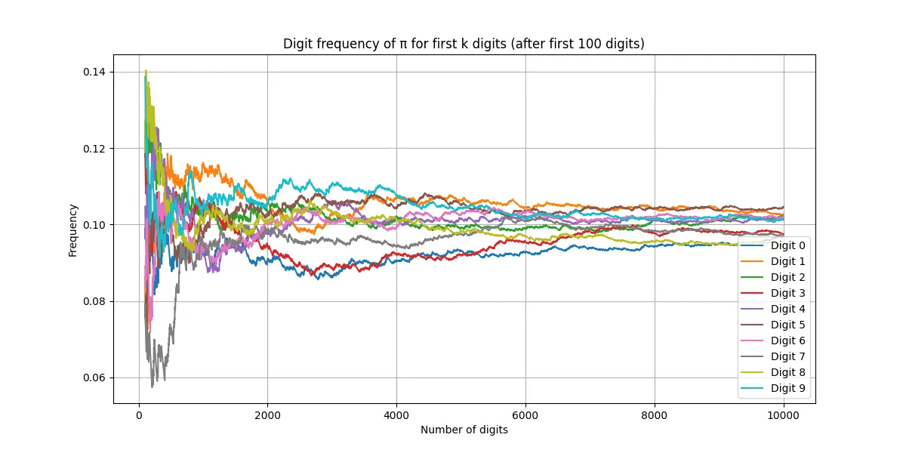

> Let me show you. $\pi$. The ratio of the circumference of a circle to its diameter. And this is just the beginning. It keeps on going. Forever. Without ever repeating. 
> Which means that contained within this string of decimals is every single other number. Your birth date, combination to your locker, your social security number. It's all in there somewhere. 
> And if you convert these decimals into letters, you would have every word that ever existed in every possible combination. The first syllable you spoke as a baby, the name of your latest crush, your entire life story from beginning to end. 
> Everything we ever say or do, all of the world's infinite possibilities rest within this one simple circle. 
> Now what you do with that information, what it's good for, well, that would be up to you.  
> — *Person of Interest, Season 2 Episode 11.

> 看看。$\pi$ 是圆的周长与直径的比值，但这只是开始，它不断延伸，永无止境，从不重复。
> 这意味着在这串小数中，潜藏着所有的数字：你的生日，你储物柜的密码，你的社会安全号码，它们都在 $\pi$ 的某个地方。
> 如果你把这些小数转换成字母，你会得到所有曾经存在过的词语，以各种可能的组合出现。你婴儿时期发出的第一个音节，你最近暗恋的名字，你从头到尾的人生故事。  
> 以及我们说过与做过的一切，世界的一切无限可能，都蕴含在这个简单的圆之中。  
> 至于你如何理解这些信息，它能带来什么，那就取决于你自己了。  
> ——《疑犯追踪》第二季第 11 集。

:::note
当然，**其实这句话是错误的**，或者说，是**未证实的**（详细会在后文展开说明），:spoiler[但是很浪漫不是吗？]
:::

接下来，我将首先针对一些在这个电视剧片段的视频的评论区中看到的有关圆周率的观点作出讨论，在这个过程中，我会忽略一些可能需要的前置知识，:spoiler[比如泰勒展开的推导]，因为我认为这些知识对于讨论圆周率本身来说，并不是必要的。

## 目录

- [目录](#目录)
- [1. 热身：关于评论区中的常见观点](#1-热身关于评论区中的常见观点)
  - [1.1. 观点一：因为圆周率是无限不循环小数，所以它会出现所有数字组合](#11-观点一因为圆周率是无限不循环小数所以它会出现所有数字组合)
    - [1.1.1. 第一种反例](#111-第一种反例)
    - [1.1.2. 拓展：刘维儿数](#112-拓展刘维儿数)
    - [1.1.3. 第二种反例](#113-第二种反例)
  - [1.2. 观点二：根据无限猴子定律，圆周率总会出现所有数字组合](#12-观点二根据无限猴子定律圆周率总会出现所有数字组合)
  - [1.3. 观点三：圆周率的所有数码的出现频率是均匀的，所以必然出现所有数字组合](#13-观点三圆周率的所有数码的出现频率是均匀的所以必然出现所有数字组合)
    - [1.3.1. 拓展：Simply Normal Number 与 Normal Number](#131-拓展simply-normal-number-与-normal-number)
    - [1.3.2. Simply Normal Number 是否必然包含所有数字组合？](#132-simply-normal-number-是否必然包含所有数字组合)
    - [1.3.3. 圆周率是否是 Simply Normal Number？](#133-圆周率是否是-simply-normal-number)
  - [1.4. 观点四：圆周率无穷无尽是因为目前算力不足](#14-观点四圆周率无穷无尽是因为目前算力不足)
    - [1.4.1. 证明步骤 1：证明非零有理数正切值都是无理数](#141-证明步骤-1证明非零有理数正切值都是无理数)
    - [1.4.2. 证明步骤 2：证明圆周率是无理数](#142-证明步骤-2证明圆周率是无理数)
    - [1.4.3. 补充 1：连分数展开的推导](#143-补充-1连分数展开的推导)
- [2. 关于数学中的反直觉现象](#2-关于数学中的反直觉现象)
  - [2.1. Borwein 积分](#21-borwein-积分)

## 1. 热身：关于评论区中的常见观点

### 1.1. 观点一：因为圆周率是无限不循环小数，所以它会出现所有数字组合

这个观点是在初学者中非常常见的误区，纠正这个观点可以说几乎就是我当初进行关于圆周率的科普的初衷。

首先重新表述一下这个观点，他希望采用的经典三段论论证法：

1. 前提：**无限不循环小数中包含所有数字组合**
2. 条件：圆周率是无限不循环小数
3. 结论：圆周率包含所有数字组合

那么，我们要说明他的论证方法有误，实际上只需要推翻前提即可。

#### 1.1.1. 第一种反例

显然，我们可以构造一个无限不循环小数：$a = 0.1010010001000010\ldots$，它的规律是，相邻的两个 $1$ 之间间隔的 $0$ 的个数依次增加，即 $a = \sum\limits_{i=1}^{\infty} \frac{1}{10^{\frac{i(i + 1)}{2}}}$。很显然，$a$ 不可能是循环小数，并且，$a$ 中不包含 $1$，因此，$a$ 不包含所有数字组合，所以，前提不成立，论证方法有误。

#### 1.1.2. 拓展：刘维儿数

事实上，刚才那个反例的构造完全是为了方便对方理解，它其实只需要稍加改造，就可以得到刘维儿数：

$$
a = 0.110001000000000000000001000\ldots = \sum\limits_{i=1}^{\infty} \frac{1}{10^{i!}}
$$

~~但是，这个数难道有什么特殊的吗？~~

事实上，这个数非常特殊，它是最早被证明出的超越数。

什么是超越数？简而言之，就是不能用整系数多项式表示的数，即不是代数数的数。譬如，任何有理数都可以表示为两个整数的比值，即 $a = \frac{p}{q}$，那么，它就一定是方程 $q * x - p = 0$ 的根，所以**任意有理数都是代数数**。而反过来，方程 $x^2 - 2 = 0$ 的根，即 $\sqrt{2}$，就不能表示为两个整数的比值，因此，$\sqrt{2}$ 是代数数但不是有理数，**代数数是一个比有理数更广泛的数集**。

#### 1.1.3. 第二种反例

看完第一个反例，许多人会觉得，这个数太特殊了，而且人工构造的痕迹太重，所以不能作为反例。事实上只需要找到一个反例，不管是什么，就可以否定一个全称命题了，但是无所谓，因为其他反例也非常容易构造：将 $\pi$ 的十进制表示中，任意出现数码 $9$ 的地方，替换为 $0$，得到一个新的数 $b$，显然，$9$ 一定不会出现在 $b$ 中，因此，$b$ 不包含所有数字组合。

你可能注意到了，我这里**并没有说 $b$ 是无理数**，尽管这看似非常显然，因为只要把 $b$ 写出来就发现它非常凌乱，但是，不能因为一个数看起来很乱，就断定它不是无理数。事实上，不断进行刚才的替换，继续把 $8$ 换成 $0$，$7$ 换成 $0$，几次之后，$\pi$ 就变成了有理数 $0$，因此刚才的操作确实是有让无理数变成有理数的风险的。

那么 $b$ 到底是有理数还是无理数呢？我的答案是：**我不知道**！如果有人能证明或者推翻这个结论，也可以发给我让我观摩一下。

### 1.2. 观点二：根据无限猴子定律，圆周率总会出现所有数字组合

这个观点实际上算的上“Not Even Wrong”了（原谅我用词可能比较重），因为无限猴子定律讲的是随机事件，而圆周率本身根本是一个**确定的**数，这两个完全是不同的领域，所以，这个观点是错误的。

但是呢，这个观点其实也有迹可循，因为 $\pi$ 表现的真的很像一个每一位都是从 $0$ 到 $9$ 随机分布的数，有关这种“看起来随机的确定数”，其实数学上还真的有专门的研究，叫做 **Normal Number**，中文译文通常为“**正规数**”或者“**正常数**”，在[后文](#131-拓展simply-normal-number-与-normal-number)我会再次提到它，这里留个引子。但是这块内容的中文翻译其实十分混乱，比如另一个叫 **Regular Number**（**正则数**）的概念，有时也会被翻译成“正规数”。因此我后文尽量用英文来描述，以减少歧义。

### 1.3. 观点三：圆周率的所有数码的出现频率是均匀的，所以必然出现所有数字组合

这个观点非常有意思。因为这已经越来越接近 Normal Number 的定义了（事实上就是 Simply Normal Number 的定义），所以，我们有必要先了解一下 Normal Number。

#### 1.3.1. 拓展：Simply Normal Number 与 Normal Number

Simply Normal Number 是 Normal Number 的一个子集，它们的定义如下：

> A real number is said to be **simply normal** in an integer base $b$ if its infinite sequence of digits is distributed uniformly in the sense that each of the digit values has the same natural density $\frac{1}{b}$. A number is said to be normal in base $b$ if, for every positive integer $n$, all possible strings $n$ digits long have density $b^{-n}$.
>
> 来源：[HandWiki - Normal number](https://handwiki.org/wiki/Normal_number)

简单来说：如果某个数在某个进制下，它的每一位数码的出现频率都是 $\frac{1}{b}$，那么这个数就是 Simply Normal Number，如果它满足对于任意正整数 $n$，所有长度为 $n$ 的字符串的出现频率都是 $b^{-n}$，那么它就是 Normal Number。

用更加形式化的语言：
> 设 $b$ 是大于 $1$ 的整数，$x$ 是实数。考虑以 $b$ 为底的位值记数法中 $x$ 的数字序列。若 $s$ 是以 $b$ 为底的有限数字序列，我们以 $N(s, n)$ 表示字串 $s$ 在 $x$ 的开首 $n$ 个数字出现次数。数 $x$ 称为以 $b$ 为底正规当且仅当对任意长度 $k$ 的字串 $s$ 有：$\lim_{n \to \infty} \frac{N(s, n)}{n} = \frac{1}{b^k}$。
>
> 来源：[百度百科 - 正规数](https://baike.baidu.com/item/%E6%AD%A3%E8%A7%84%E6%95%B0/8660908)

不难看出，只要 $\pi$ 是一个 Normal Number，那么它必然会出现所有数字组合。

但是，这个观点的意思是：Simply Normal Number 中必然出现每一种数字组合。那下面我们先来否定这一点。

#### 1.3.2. Simply Normal Number 是否必然包含所有数字组合？

先说结论：**不一定**。仍然通过我惯用的举反例。令 $c = 0.012345678900112233445566778899000\ldots$，显然，$c$ 中不含有 $10$ 这个连续数字组合，接下来我们证明 $c$ 是 Simply Normal Number。

首先，我们计算 $0$ 的出现概率的极限：
在前 $n$ 位中，我们考虑最后一个完整的 $0$ 到 $9$ 的重复序列，假设这个序列中，每一个数码出现的次数都是 $k$，那么，在截断到这一位后，$0$ 出现了 $\sum\limits_{i=1}^{k} i = \frac{k(k + 1)}{2}$，总共有 $\sum\limits_{i=1}^{k} 10 \cdot i = 5k(k + 1)$，由于这是最后一个完整的序列，因此在这之后到下一次产生一个完整序列，$0$ 的出现概率是先增加后减小的，并且两端都恰好是 $\frac{1}{10}$，因此出现概率 $\frac{\frac{k(k + 1)}{2} + (k + 1)}{5k(k + 1) + (k + 1)} \geq P_0 \geq \frac{1}{10}$，考虑 $\lim_{k \to \infty} \frac{\frac{k(k + 1)}{2} + (k + 1)}{5k(k + 1) + (k + 1)} = \lim_{k \to \infty} \frac{k + 1}{10k + 2} = \frac{1}{10}$，根据夹逼定理，极限存在，并且 $\lim_{k \to \infty} P_0 = \frac{1}{10}$。

类似的，可以证明 $1$ 到 $9$ 的出现概率都是 $\frac{1}{10}$。因此，$c$ 是 Simply Normal Number，并且不包含 $10$ 这个数字组合。

#### 1.3.3. 圆周率是否是 Simply Normal Number？

据前文所属，如果 $\pi$ 是一个 Normal Number，那出现所有数字组合是必然的，这也是数学界正在努力的方向，然而，目前数学界还没有证明 $\pi$ 是一个 Normal Number，甚至，据我所知，目前数学界还没有证明 $\pi$ 是一个 Simply Normal Number。

但是我们可以做一个小实验看一下 $\pi$ 的前 $n$ 位的分布。

代码如下（后续有机会我会介绍这个算法，参考《数值计算方法》）：
```python
from collections import Counter
from math import ceil
from typing import Dict, List, Tuple

import matplotlib.pyplot as plt
import mpmath


def compute_pi(n_digits: int) -> str:
    """Chudnovsky 算法"""
    digits_per_term = 14
    n_terms = ceil(n_digits / digits_per_term)
    mpmath.mp.dps = n_digits + 2  # 设置浮点精度防止舍入误差

    C = 426880 * mpmath.sqrt(10005)
    sum_term = mpmath.mpf(0)

    for k in range(n_terms):
        numerator = (-1) ** k * mpmath.factorial(6 * k) * (13591409 + 545140134 * k)
        denominator = (
            mpmath.factorial(3 * k) * (mpmath.factorial(k) ** 3) * (640320 ** (3 * k))
        )
        sum_term += numerator / denominator

    pi_val = C / sum_term
    return str(pi_val)[: 2 + n_digits]


def digit_frequency_over_k(
    pi_str: str, step: int = 1000
) -> Tuple[List[int], Dict[str, List[float]]]:
    pi_digits = pi_str.replace(".", "")
    k_list = []
    freq_dict = {str(i): [] for i in range(10)}

    for k in range(step, len(pi_digits) + 1, step):
        k_list.append(k)
        counter = Counter(pi_digits[:k])
        for d in range(10):
            freq_dict[str(d)].append(counter[str(d)] / k)

    return k_list, freq_dict


if __name__ == "__main__":
    n = 10000  # 计算前 10000 位
    step = 1

    pi_digits = compute_pi(n)
    k_list, freq_dict = digit_frequency_over_k(pi_digits, step)

    # 跳过前 100 位频率波动过大的区域让图像容易观察
    start_index = 100
    k_plot = k_list[start_index:]
    freq_plot = {d: freq_dict[d][start_index:] for d in freq_dict}

    plt.figure(figsize=(12, 6))
    for d in range(10):
        plt.plot(k_plot, freq_plot[str(d)], label=f"Digit {d}")

    # 懒得设置字体，所以用英文防止乱码
    plt.xlabel("Number of digits")
    plt.ylabel("Frequency")
    plt.title("Digit frequency of π for first k digits (after first 100 digits)")
    plt.legend()
    plt.grid(True)
    plt.show()
```

运行结果如下：



### 1.4. 观点四：圆周率无穷无尽是因为目前算力不足

如果说观点二让我觉得“Not Even Wrong”，那么观点四就无语到让我都没法说是“Not Even Wrong”了，当然，我们并不能苛求普通人能够自主证明 $\pi$ 为什么无限不循环。但是 $\pi$ 作为无理数应该是在义务教育阶段就不断强调的，尽管义务教育阶段并不会给出证明，至少作为一个结论是应该被接受的。不过既然有人不知道，正好，我接下来就进行一个简要的证明。

#### 1.4.1. 证明步骤 1：证明非零有理数正切值都是无理数

如果已知 $\tan x$ 的连分数展开（其证明我将在[后文](#143-补充-1连分数展开的推导)给出，在本节中请默认为真）为：

$$
\tan x = \frac{x}{1 - \frac{x^2}{3 - \frac{x^2}{5 - \frac{x^2}{7 - \ddots}}}}
$$

如果有理数 $x = \frac{p}{q}$，那么：

$$
\tan \frac{p}{q} = \frac{p}{q - \frac{p^2}{3q - \frac{p^2}{5q - \frac{p^2}{7q - \ddots}}}}
$$

令 $f_k = \frac{p^2}{kq - \frac{p^2}{(k + 2)q - \frac{p^2}{(k + 4)q - \ddots}}}$，那么：$\tan \frac{p}{q} = \frac{p}{q - \frac{p^2}{3q - \frac{p^2}{5q - \ddots \frac{p^2}{(k - 2)q - f_k}}}}$。

不难发现，当 $k$ 足够大时，$0 < f_k < 1$。令最小的让 $0 < f_k < 1$ 的 $k$ 为 $k_0$，那么显然，由于在表达式中除了 $f_k$ 都是有限的有理式，因此 $\tan \frac{p}{q}$ 是有理数的充分必要条件就是 $f_k$ 是有理数。

接下来我们使用反证法，反设 $f_k$ 是有理数 $\frac{B}{A}$，其中 $B > A > 0$，那么有：

$$
\frac{B}{A} = f_k = \frac{p^2}{kq - \frac{p^2}{(k + 2)q - \frac{p^2}{(k + 4)q - \ddots}}} = \frac{p^2}{kq - f_{k+2}}
$$

化简得到：
$f_{k+2} = \frac{Bkq - Ap^2}{B}$，而类似的，也有 $0 < f_{k+2} < 1$，而这个表达式又说明了 $f_{k+2}$ 也是有理数，那么，令 $C = Bkq - Ap^2$，有 $f_{k+2} = \frac{C}{B}$，于是有 $A > B > C > 0$，类似地，这个过程可以不断的进行下去，得到 $A > B > C > D > \cdots > 0$，但是，它们都是有限的正整数，而严格大于导致了每一次至少让分子变小 $1$，因此这个过程最多进行 $A$ 次，这与之前的这个过程必须无限进行矛盾，因此，反证假设 $f_k$ 是有理数是不成立的，因此 $\tan \frac{p}{q}$ 的值都是无理数。

#### 1.4.2. 证明步骤 2：证明圆周率是无理数

由于在 1.4.1 节中，我们已经证明了，如果 $x$ 是有理数，那么 $\tan x$ 是无理数，而 $\tan \frac{\pi}{4} = 1$，这并不是无理数，因此 $\frac{\pi}{4}$ 是无理数，由于 $\pi = 4 \times \frac{\pi}{4}$，因此 $\pi$ 是无理数。证毕。

> 这条证明思路最早由 Lambert 在 1768 年提出。

#### 1.4.3. 补充 1：连分数展开的推导

**这部分证明是不严谨的，仅作为参考，其收敛域不做讨论，尽管要在证明中用到实际上是需要说明收敛域的。此外，这里给出的 $\sin x$ 和 $\cos x$ 的泰勒展开也不做深入，因为有关这些是非常容易找到资料的。**

首先，给出几个泰勒展开式：

$$
\begin{cases}
    \sin x = x - \frac{x^3}{3!} + \frac{x^5}{5!} - \frac{x^7}{7!} + \cdots = \sum\limits_{i=0}^{\infty} (-1)^i \frac{x^{2i + 1}}{(2i + 1)!} \\
    \cos x = 1 - \frac{x^2}{2!} + \frac{x^4}{4!} - \frac{x^6}{6!} + \cdots = \sum\limits_{i=0}^{\infty} (-1)^i \frac{x^{2i}}{(2i)!} \\
    \frac{\sin x}{x} = 1 - \frac{x^2}{3!} + \frac{x^4}{5!} - \frac{x^6}{7!} + \cdots = \sum\limits_{i=0}^{\infty} (-1)^i \frac{x^{2i}}{(2i + 1)!}
\end{cases}
$$

于是，有：

$$
\tan x = \frac{x}{\frac{\cos x}{\frac{\sin x}{x}}} = \frac{x}{\frac{\sum\limits_{i=0}^{\infty} (-1)^i \frac{x^{2i}}{(2i)!}}{\sum\limits_{i=0}^{\infty} (-1)^i \frac{x^{2i}}{(2i + 1)!}}}
$$

记：$P_1(x) = \sum\limits_{i=0}^{\infty} (-1)^i \frac{x^{2i}}{(2i)!}$，$Q_1(x) = \sum\limits_{i=0}^{\infty} (-1)^i \frac{x^{2i}}{(2i + 1)!}$，$\frac{P_k(x)}{Q_{k}(x)} = \frac{P_k(0)}{Q_k(0)} + \frac{x^2}{\frac{P_{k + 1}(x)}{Q_{k + 1}(x)}}$，再令 $\lambda_{k} = \frac{P_k(0)}{Q_k(0)}$，有：

$$
\begin{cases}
    P_{k + 1}(x) = Q_k(x) \\
    Q_{k + 1}(x) = \frac{P_k(x) - \lambda_k Q_k(x)}{x^2} \\
    \lambda_{k} = \frac{P_k(0)}{Q_k(0)} \\
    P_1(x) = \sum\limits_{i=0}^{\infty} (-1)^i \frac{x^{2i}}{(2i)!} \\
    Q_1(x) = \sum\limits_{i=0}^{\infty} (-1)^i \frac{x^{2i}}{(2i + 1)!}
\end{cases}
$$

$$
\begin{aligned}
    \frac{P_1(x)}{Q_1(x)} - 1 &= \frac{\sum\limits_{i=0}^{\infty} (-1)^i x^{2i} [\frac{1}{(2i)!} - \frac{1}{(2i + 1)!}]}{\sum\limits_{i=0}^{\infty} (-1)^i \frac{x^{2i}}{(2i + 1)!}} \\
    &= \frac{\sum\limits_{i=1}^{\infty} (-1)^i x^{2i} \frac{2i}{(2i + 1)!}}{\sum\limits_{i=0}^{\infty} (-1)^i \frac{x^{2i}}{(2i + 1)!}} \\
    &= x^2 \frac{\sum\limits_{i=0}^{\infty} (-1)^{(i + 1)} x^{2i} \frac{2i + 2}{(2i + 3)!}}{\sum\limits_{i=0}^{\infty} (-1)^i \frac{x^{2i}}{(2i + 1)!}} \\
    &= \frac{x^2}{\frac{\sum\limits_{i=0}^{\infty} (-1)^i \frac{x^{2i}}{(2i + 1)!}}{\sum\limits_{i=0}^{\infty} (-1)^{(i + 1)} x^{2i} \frac{2i + 2}{(2i + 3)!}}}
\end{aligned}
$$

故 $P_2(x) = \sum\limits_{i=0}^{\infty} (-1)^i \frac{x^{2i}}{(2i + 1)!}$，$Q_2(x) = \sum\limits_{i=0}^{\infty} (-1)^{(i + 1)} x^{2i} \frac{2i + 2}{(2i + 3)!}$。显然 $\lambda_1 = 1$，$\lambda_2 = -3$

归纳假设：

$$
\begin{cases}
    P_{2m}(x) = \sum\limits_{i=0}^{\infty} (-1)^{i + m - 1} \frac{(2i + 2)(2i + 4)\ldots(2i + 4m - 4)}{(2i + 4m - 3)!} x^{2i} \\
    Q_{2m}(x) = \sum\limits_{i=0}^{\infty} (-1)^{i + m} \frac{(2i + 2)(2i + 4)\ldots(2i + 4m - 2)}{(2i + 4m - 1)!} x^{2i} \\
    \lambda_{2m} = -(4m - 1) \\
    P_{2m + 1}(x) = \sum\limits_{i=0}^{\infty} (-1)^{i + m} \frac{(2i + 2)(2i + 4)\ldots(2i + 4m - 2)}{(2i + 4m - 1)!} x^{2i} \\
    Q_{2m + 1}(x) = \sum\limits_{i=0}^{\infty} (-1)^{i + m} \frac{(2i + 2)(2i + 4)\ldots(2i + 4m)}{(2i + 4m + 1)!} x^{2i} \\
    \lambda_{2m + 1} = 4m + 1
\end{cases}
$$

那么，有：

$$
P_{2k + 2}(x) = Q_{2k + 1}(x) = \sum\limits_{i=0}^{\infty} (-1)^{i + k} \frac{(2i + 2)(2i + 4)\ldots(2i + 4k)}{(2i + 4k + 1)!} x^{2i}
$$

$$
\begin{aligned}
    Q_{2k + 2}(x) &= \frac{P_{2k + 1}(x) - \lambda_k Q_{2k+ 1}(x)}{x^2} \\
    &= \frac{\sum\limits_{i=0}^{\infty} (-1)^{i + k} \frac{(2i + 2)(2i + 4)\ldots(2i + 4k - 2)}{(2i + 4k - 1)!} x^{2i} [1 - \frac{(4k + 1)(2i + 4k)}{(2i + 4k)(2i + 4k + 1)}]}{x^2} \\
    &= \frac{\sum\limits_{i=1}^{\infty} (-1)^{i + k} \frac{(2i + 2)(2i + 4)\ldots(2i + 4k - 2)}{(2i + 4k - 1)!} x^{2i} \frac{2i}{2i + 4k + 1}}{x^2} \\
    &= \sum\limits_{i=0}^{\infty} (-1)^{i + k + 1} \frac{(2i + 2)(2i + 4)(2i + 6)\ldots(2i + 4k)}{(2i + 4k + 1)!} x^{2i} \frac{1}{2i + 4k + 3} \\
    &= \sum\limits_{i=0}^{\infty} (-1)^{i + k + 1} \frac{(2i + 2)(2i + 4)(2i + 6)\ldots(2i + 4k + 2)}{(2i + 4k + 3)!} x^{2i}
\end{aligned}
$$

$P_{2k + 3}$ 与 $Q_{2k + 3}$ 的推导类似，这里省略，最后，由数学归纳法，假设成立。

因此：

$$
\begin{aligned}
    \tan x &= \frac{x}{\frac{P_1(x)}{Q_1(x)}} \\
    &= \frac{x}{\lambda_1 + \frac{x^2}{\frac{P_2(x)}{Q_2(x)}}} \\
    &= \frac{x}{\lambda_1 + \frac{x^2}{\lambda_2 + \frac{x^2}{\frac{P_3(x)}{Q_3(x)}}}} \\
    &= \cdots \\
    &= \frac{x}{\lambda_1 + \frac{x^2}{\lambda_2 + \frac{x^2}{\lambda_3 + \cdots}}} \\
    &= \frac{x}{1 + \frac{x^2}{-3 + \frac{x^2}{5 + \frac{x^2}{-7 + \cdots}}}} \\
    &= \frac{x}{1 - \frac{x^2}{3 - \frac{x^2}{5 - \frac{x^2}{7 - \cdots}}}} \\
\end{aligned}
$$

于是，我们得到了 $\tan x$ 的连分数展开式。

## 2. 关于数学中的反直觉现象

### 2.1. Borwein 积分

这个相关的内容，其实 3blue1brown（[Youtube](https://www.youtube.com/@3blue1brown)、[Bilibili](https://space.bilibili.com/88461692)）已经讲的很明白了，所以我写这部分主要是验证自己的学习情况，详情可以参考这个视频：

<iframe width="100%" height="468" src="//player.bilibili.com/player.html?bvid=BV18e4y1u7BH&p=1&autoplay=0" scrolling="no" border="0" frameborder="no" framespacing="0" allowfullscreen="true" &autoplay=0> </iframe>
