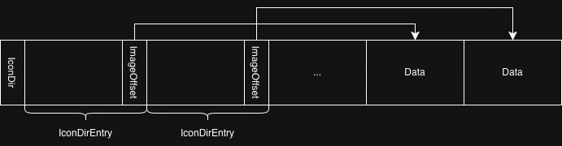
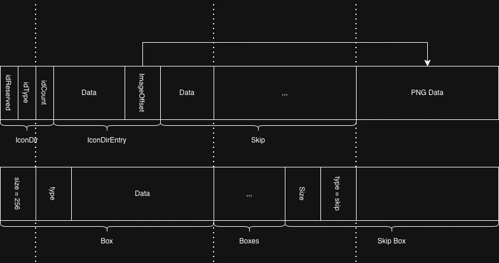

[文件样本链接](https://wwwe.lanzouq.com/iZTlX3b2loqd)

[文件样本 MD5](https://wwwe.lanzouq.com/i32QG3b3ljib)

:::important
**安全声明**：为保证安全性请不要字节在生产环境从不可信来源运行/双击不知来源的文件，我的文件样本也未必可信。
:::

:::tip
为了正常上传到网盘，文件样本被压缩成了 `压缩包.zip`，请先解压得到名为 `output` 的无后缀文件后再操作。
:::


乍看之下，这是一个普通的文件，唯一的不寻常之处在于：它没有后缀名。

<br>

重命名这个文件，将它的后缀改为 `.mp4`，得到了 `output.mp4`：


并且它完全可以正常播放，你可以看到我用 `figlet` 输出了 `hello, world`：


那么似乎很明了了：这个文件完全没有什么奇怪的，就是一个正常的 MP4 视频，只不过我把它的后缀去掉了！

但是事情真的有这么简单吗？:spoiler[废话，要是简单的话我为什么要写这篇文章。]

<br>

如果再把他改成 `output.png`：


居然变成了一张图片？而且图片的内容和视频完全不同，变成了我的博客截图。

<br>

如果再改成 `output.pdf` 会发生什么呢？

居然又变成了一份文档，并且内容又一次和之前完全不一样，这次则是我的 FireFox 浏览器的主页。

<br>

`output.zip` 同样成为了一个压缩包。

这个文件甚至还可以改成 `output.html`！改完之后双击或者从浏览器打开，甚至能看到一个网站。**这个 HTML 文件里面我放了彩蛋，所以就不展示了，希望读者自行体验。**

一个文件，它居然可以同时是 `mp4, png, pdf, zip, html`。那么，这是怎么做到的呢？

## 目录

- [目录](#目录)
- [1. 写作背景与免责声明](#1-写作背景与免责声明)
- [2. 思路讲解](#2-思路讲解)
  - [2.1. 一种可能的实现](#21-一种可能的实现)
  - [2.2. Polyglot 文件简介](#22-polyglot-文件简介)
  - [2.3. 正确的实现](#23-正确的实现)
    - [2.3.1. 电脑是怎么看待文件的](#231-电脑是怎么看待文件的)
    - [2.3.2. 文件魔数](#232-文件魔数)
    - [2.3.3. MP4 文件的格式](#233-mp4-文件的格式)
    - [2.3.4. 一些解释](#234-一些解释)
    - [2.3.5. ICO 文件的格式](#235-ico-文件的格式)
    - [2.3.6. 合并 ICO 文件与 MP4 文件](#236-合并-ico-文件与-mp4-文件)
  - [2.4. 增加更多文件](#24-增加更多文件)
- [附录](#附录)
  - [附录 A. Polyglot 代码](#附录-a-polyglot-代码)
    - [附录 A.1. Polyglot 代码作为 bash](#附录-a1-polyglot-代码作为-bash)
    - [附录 A.2. Polyglot 代码作为 PHP](#附录-a2-polyglot-代码作为-php)
    - [附录 A.3. Polyglot 代码作为 C](#附录-a3-polyglot-代码作为-c)
  - [附录 B. 合并 MP4 和 PNG 的 Python 代码](#附录-b-合并-mp4-和-png-的-python-代码)
- [参考资料](#参考资料)

## 1. 写作背景与免责声明

我在 Bilibili 发现了 [一个视频](https://www.bilibili.com/video/BV18wshzSExd/)，里面的内容引起了我的兴趣，讲的就是本文的内容。

:::important
只是为了详细描述我的写作背景而提到了这个 Bilibili 视频，但是事实上本人强烈不推荐、以及从版权角度上反对这个视频，原因包括但不限于：机翻、转载投自制、未给出原视频链接、完全照搬。如果需要了解，请观看 [原创内容](https://www.youtube.com/watch?v=o7qx-wgl3jo)
:::

这个视频的风格和内容我十分喜欢，但是由于糟糕的翻译，比如：


这段将 PNG 翻译为“巴布亚新几内亚（Papua New Guinean）”，而这只是众多糟糕翻译中的一例，这导致整个视频令人完全看不懂。由于这个视频没有指明原视频的链接，我废了一番功夫找到了 [原视频](https://www.youtube.com/watch?v=o7qx-wgl3jo)，并认为十分有趣，由于国内的读者可能受限于英语能力或者糟糕机翻而无福享受，本人将其重新理解并写成博客。

:::tip
本文虽然受到原视频的启发，但是对于一些原视频没有提及的细节、以及一些原视频受限于长度无法展示的内容，我也会进行补充。

同时，不同于原视频使用 `javascript` 编写代码，本文使用 `python` 进行了重构，并且对其中一些可读性很差的地方进行了优化，同时对于某些算法可能有所改进，以及补充了部分示意图说明。我的目标是，即使已经看过原视频，也能在本文中略有收获。
:::

## 2. 思路讲解

### 2.1. 一种可能的实现

部分敏锐的读者也许会想：想要实现这种功能，也许可以让一段代码在在后台监听文件的变化，而动态地修改文件的内容。

但刚刚的演示读者完全可以在自己的机器上复现，而读者的机器上并没有我的后台代码正在运行，总不可能这个文件一旦被解压就会释放一个可以绕过读者的隐秘并执行吧？

事实上，刚才的效果完全依靠文件本身的特性来实现，这种文件也有一个名字：**Polyglot 文件（混合类型文件）**。

### 2.2. Polyglot 文件简介


图片来源：[维基百科：Polyglot](https://en.wikipedia.org/wiki/Polyglot_%28computing%29)

不过这个名称通常用来指代的是：同时可以成为多种编程语言的合法代码的文件，例如：

[Polyglot 代码作为合法的 bash](#附录-a1-polyglot-代码作为-bash)

[Polyglot 代码作为合法的 PHP](#附录-a2-polyglot-代码作为-php)

[Polyglot 代码作为合法的 C](#附录-a3-polyglot-代码作为-c)

它同时是合法的 `bash, PHP, C`，它的构造方法就是巧妙的利用不同语言的不同注释方式。

所以构造 Polyglot 代码文件的关键几乎都是利用好注释，**这点很重要，它为我们构造 Polyglot 多媒体文件提供了指导思想。**

事实上，有些恶意软件也会通过 polyglot 文件传播。

### 2.3. 正确的实现

#### 2.3.1. 电脑是怎么看待文件的

只要了解计算机的大概都知道，任何文件都是以二进制的形式存储在计算机上面的，计算机并不认识所谓“图片”，“视频”，所有文件操作其实都是对二进制进行的。

那文件后缀到底有什么用呢？其实它的作用就是：告诉计算机用什么程序处理，乃至用哪个函数处理这个文件：用图片查看器处理 `.png, .ico, .jpg`，用视频播放器处理 `.mp4, .mov`，用浏览器查看 `.html`，但是浏览器也可以查看各种图片……

因此，文件后缀对于计算机来说其实并没有什么意义，你完全可以手动右键选择处理方式，文件后缀存在的目的只是为了给你一个方便，让你不再需要指定用什么程序来处理这个文件。而我们要做的，就是构造一种二进制序列，让它可以是多种格式的合法文件。

比如，其实可以完全不重命名我的 `output`，直接右键选择打开方式使用图片查看器，自然也能看到图片。

也许会有读者提出疑问：尽管文件后缀是用来指定处理程序的，但是也可以有其他用途啊，比如，既然一种程序可以处理多种后缀，那后缀能不能用来指定处理的方式呢？其实是可以的，但是大部分软件并不这么做：当你把一个 PNG 文件的后缀改为 `.jpg` 而不改变实际格式，理论上程序用 `.jpg` 的方式处理就会出错，但是通常来说，当你用图片查看器打开的时候，还是能正常的看到图片。

那么很自然的，既然一种程序可以处理多种后缀，而具体的处理方式又和后缀无关，那么必然有什么文件内部的东西告诉了程序用什么方式处理。这种东西就是**文件魔数（magic number）**。

#### 2.3.2. 文件魔数

用二进制/十六进制编辑器打开任何一个 PNG 文件，你大概会看到这样的东西：


PNG 文件的前八个字节永远是 `\x89 \x50 \x4E \x47 \x0D \x0A \x1A \x0A`。

而如果把它改成这个值以外的任何值，都会让图片查看器崩溃：


类似的，大部分的多媒体文件的魔数都位于前几个字节：

| 文件格式            | 魔数（Hex）                   | 说明                         |
| --------------- | ------------------------- | -------------------------- |
| **PNG**         | `89 50 4E 47 0D 0A 1A 0A` | 最经典的标志，以 `89 50 4E 47` 开头。 |
| **JPG / JPEG**  | `FF D8 FF`                | 以 FF D8 开头，以 `FF D9` 结束。   |
| **GIF87a**      | `47 49 46 38 37 61`       | ASCII 为 `GIF87a`。          |
| **GIF89a**      | `47 49 46 38 39 61`       | ASCII 为 `GIF89a`。          |
| **BMP**         | `42 4D`                   | ASCII 为 `BM`。              |
| **WEBP (RIFF)** | `52 49 46 46`             | RIFF 容器，以 RIFF/WEBP 包含。    |
| **ICO**         | `00 00 01 00`             | 图标文件。                      |

但是等等……这岂不是说无论如何构造，总会在魔数上发生冲突？

事实上，如果我们选用的全都为魔数在头部的文件类型，那这个任务就不可能完成了，但是万幸：

1. 有一些文件的魔数可以不在前几个字节。
2. 另一些文件则没有魔数。
3. 还有的文件，尽管标准规定魔数在头部，但是解析器的宽容让它可以整体往后移动。

而 MP4 就恰好属于第一类。

#### 2.3.3. MP4 文件的格式

MP4 文件事实上是由多个 Box（或者 FullBox）顺序排列形成的，每个 Box/FullBox 里面装了一些数据。

对于 Box/FullBox，前四个字节是长度 size 字段，第四到八个字节是类型 type 字段。如下图所示：


它的前四个字节是 `\x00 \x00 \x00 \x20`，说明这个 Box 的长度是 32 字节，紧跟其后的是 `\x66 \x74 \x79 \x70`，表示这个 Box 的类型是 `ftyp`，表示它存放文件类型和兼容品牌。

下面框选出了 ftyp Box 的范围：


于是跟在它后面的就是第二个 Box 了，类型是 `free`，长度为 8 字节...

<br>

值得注意的是：

虽然大部分 MP4 文件中 `ftyp` 会出现在最前，但是由于一些历史原因，在一些特殊情况下，MP4 甚至可以没有 `ftyp`。

> All files shall contain a file type box, but for compatibility reasons with an earlier version of the specification, files may be conformant to ISO/IEC base media file format and not contain a file type box. In that case, they should be read as if they contained an ftyp with a major and compatible brand “mp41” (MP4 v1 – ISO 14496‑1, Chapter 13).
>
> 来源：[Wiki: ISO base media file format](https://en.wikipedia.org/wiki/ISO_base_media_file_format)

> 翻译：所有文件都应包含一个 ftyp Box，但出于与规范早期版本的兼容性考虑，文件也可以符合 ISO/IEC 基本媒体文件格式而不包含 ftyp Box。在这种情况下，应当将其视为包含一个 ftyp，其主要品牌和兼容品牌为 “mp41”。

<br>

size 字段是指包括这个头部的全部大小，所以至少是 8，具体范围是 $8\text{B}$ 到 $(2^{32} - 1)\text{B} = 4 \text{GiB}$。但是也有例外：

1. `size == 0` 表示这个 Box/FullBox 延伸到文件末尾，因此它“必然”是最后一个，但标准没有声明它是一种“终止标志”，也就是说这样的 Box/FullBox 不一定出现。
2. `size == 1` 的时候表示四个字节无法表示这个它的长度，启用 large size，它是 type 字段之后的 8 个字节，此时 large size 才是 Box/FullBox 的真正大小。

在构造 Polyglot 多媒体文件的时候，其实我们还是主要关注 Box 就够了，因为 FullBox 也是对 Box 的扩充。

同时，选择 MP4 文件还有一个好处。

这是 MP4 文件规定的几种 Box 类型以及行为：

| 类型      | 行为                         |
| -------- | -------------------------- |
| **ftyp** | 文件类型与兼容品牌                  |
| **moov** | 文件的元数据（header/data tables） |
| **mdat** | 媒体数据（视频/音频码流）              |
| **free** | 填充区，解码器可以跳过            |
| **skip** | 也是填充区，解码器可以跳过        |
| **uuid** | 用户自定义 box                  |
| **meta** | 顶层 metadata（较少出现）          |
| **mdat** | 可出现多次                      |
| **pnot** | QuickTime 兼容               |
| **wide** | QuickTime 对齐 box           |

注意到 `skip` 类型的行为是跳过，在我们构造 Polyglot 多媒体文件的过程中，它就可以起到 Polyglot 代码中“注释”的功能，用来隐藏信息。

另外，它没有魔数，它的前四个字节表示的是 Box 的长度，这也让它具有了兼容其他文件的魔数的可能性。

:::note
由于 MP4 文件具有这么好的特性，所以它成为了一个好的选择。
:::

不妨将各个文件的文件头代入 Box 的 size 计算一下大小：

| 文件格式            | 魔数（Hex）                   | 作为 `size` 的大小                 |
| --------------- | ------------------------- | -------------------------- |
| **PNG**         | `89 50 4E 47 0D 0A 1A 0A` | 2.1GiB  |
| **JPG / JPEG**  | `FF D8 FF`                | >3.9GiB |
| **GIF87a**      | `47 49 46 38 37 61`       | 1GiB  |
| **GIF89a**      | `47 49 46 38 39 61`       | 1GiB  |
| **BMP**         | `42 4D`                   | >1GiB |
| **WEBP (RIFF)** | `52 49 46 46`             | 1.3GiB  |
| **ICO**         | `00 00 01 00`             |  256B   |

相比下来，也就只有 ICO 适合和 MP4 嵌合了，否则，第一个 Box 就有 GiB 级别的大小，会导致我们最终的文件非常大。

#### 2.3.4. 一些解释

不知道看到这的读者有没有一些疑惑：**明明我之前说的是把文件重命名成 PNG，为什么我选择是 ICO？**

其实这还是和计算机看待文件的方式有关，在之前的 [2.3.1. 电脑是怎么看待文件的](#231-电脑是怎么看待文件的) 一节中，曾经提到过：文件后缀只是用来告诉计算机用什么程序去处理这个文件，而不管是 `.png` 也好 `.ico` 也罢，不都是用图片查看器吗？到底该用什么流程去解析，是文件魔数告诉查看器的。

#### 2.3.5. ICO 文件的格式

ICO 文件是 Windows 系统的图标格式。为了在不同分辨率下显示合适的图标，一个 ICO 文件通常包含 多个分辨率的图像，常见尺寸包括 16×16、32×32、48×48 和 256×256。

类似于 MP4 是视频的容器，ICO 也是一个 图像容器。不同之处在于，ICO 内部只支持 位图（BMP） 和 PNG 两种图像格式。每个图像条目可以有不同的分辨率和颜色深度，Windows 会根据显示环境选择最合适的图标进行显示。

ICO 文件的前 6 位为 `IconDir` 字段，其中前 2 为固定为 `\x00 \x00`，紧跟着的为 2 位 `idType` 字段，`idType == \x01` 代表图标（ICO），`idType == \x02` 代表光标（CUR），最后 2 位是 `idCount` 字段，代表了 ICO 文件中拥有的图像个数。

接下来就是 `idCount` 个长度为 16 的 `IconDirEntry` 字段，具体字段见下表：

| 字段              | 长度（字节） | 描述                        |
| --------------- | ------ | ------------------------- |
| `bWidth`        | 1      | 图像宽度（像素），0 表示 256         |
| `bHeight`       | 1      | 图像高度（像素），0 表示 256         |
| `bColorCount`   | 1      | 调色板颜色数（≤256），0 表示更多颜色     |
| `bReserved`     | 1      | 保留，必须为 0                  |
| `wPlanes`       | 2      | 色平面数（通常为 1），小端            |
| `wBitCount`     | 2      | 每像素位数（1, 4, 8, 24, 32），小端 |
| `dwBytesInRes`  | 4      | 图像数据大小（字节），小端             |
| `dwImageOffset` | 4      | 图像数据在文件中的偏移量，小端           |

:::important
ICO 文件的整数含义的字段均为小端序。
:::

以下是 ICO 文件的格式示意图：



从标准来看，似乎最大也只能存放 256×256 的文件。但是事实上如果 ICO 文件内存的多个图像是 PNG 的时候，这些字段携带的信息 PNG 本身就已经存储了，之所以还保留这些字段，是为了兼容 BMP 位图。

因此，现代 ICO 文件中如果图像是 PNG，大部分查看器不会严格检查 IconDirEntry 的字段，这也给我们留下了钻空子的空间，允许我们存放“非标准”的 PNG 文件。

另外 ICO 文件的 `ImageOffset` 机制也允许我们在中间被跳过的大量字节塞入任意数据。

#### 2.3.6. 合并 ICO 文件与 MP4 文件

首先来看思路的示意图：



这张图的上半部分是图片查看器的解析方式，下半部分是视频播放器的解析方式。

ICO 文件中，`idReserverd = \x00 \x00` 和 `idType = \x01 \x00` 的部分在 MP4 中被解释为第一个 Box 的长度 `\x00 \x00 \x01 \x00 = 256`，`imageOffset` 指向的 `PNG Data` 位于 MP4 的一个 Skip Box 内，因此 MP4 看不到它，同时 MP4 内的数据被 ICO 内的 `imageOffset` 跳过。

:::note
上述只是一个简化的思路，实际上实施的时候还会遇到一些细节问题需要注意。
:::

1. 尽管 MP4 允许第一个 Box 不是 ftyp Box，但是 ftyp Box 还是要尽可能早出现，例如部分播放器会要求 ftyp Box 出现在前 1KB。
2. 需要注意小端序和大端序。
3. 不可以直接按照上述思路修改一个 MP4 文件，因为第一个头部的长度修改会导致偏移量的改变，这是因为 `moov` 类型的 Box 中含有 `stco, co64` 记录了索引表，直接操作二进制会导致错位，需要使用 `mp4edit` 自动修复。
4. 同理，插入 `skip` 类型的 Box 也需要维护索引表。

参考代码：[附录 B. 合并 MP4 和 PNG 的 Python 代码](#附录-b-合并-mp4-和-png-的-python-代码)

### 2.4. 增加更多文件

## 附录

### 附录 A. Polyglot 代码

#### 附录 A.1. Polyglot 代码作为 bash

```bash
#define a /*
#<?php
echo "\010Hello, world!\n";// 2> /dev/null > /dev/null \ ;
// 2> /dev/null; x=a;
$x=5; // 2> /dev/null \ ;
if (($x))
// 2> /dev/null; then
return 0;
// 2> /dev/null; fi
#define e ?>
#define b */
#include <stdio.h>
#define main() int main(void)
#define printf printf(
#define true )
#define function
function main()
{
printf "Hello, world!\n"true/* 2> /dev/null | grep -v true*/;
return 0;
}
#define c /*
main
#*/
```

#### 附录 A.2. Polyglot 代码作为 PHP

```php
#define a /*
#<?php
echo "\010Hello, world!\n";// 2> /dev/null > /dev/null \ ;
// 2> /dev/null; x=a;
$x=5; // 2> /dev/null \ ;
if (($x))
// 2> /dev/null; then
return 0;
// 2> /dev/null; fi
#define e ?>
#define b */
#include <stdio.h>
#define main() int main(void)
#define printf printf(
#define true )
#define function
function main()
{
printf "Hello, world!\n"true/* 2> /dev/null | grep -v true*/;
return 0;
}
#define c /*
main
#*/
```

#### 附录 A.3. Polyglot 代码作为 C

```c
#define a /*
#<?php
echo "\010Hello, world!\n";// 2> /dev/null > /dev/null \ ;
// 2> /dev/null; x=a;
$x=5; // 2> /dev/null \ ;
if (($x))
// 2> /dev/null; then
return 0;
// 2> /dev/null; fi
#define e ?>
#define b */
#include <stdio.h>
#define main() int main(void)
#define printf printf(
#define true )
#define function
function main()
{
printf "Hello, world!\n"true/* 2> /dev/null | grep -v true*/;
return 0;
}
#define c /*
main
#*/
```

### 附录 B. 合并 MP4 和 PNG 的 Python 代码

```python
import argparse
import shutil
import struct
import subprocess
import sys
import tempfile
from pathlib import Path
from typing import List, Tuple


def check_requirements() -> None:
    """检查系统是否安装了 ffmpeg 和 bento4"""
    try:
        subprocess.run(
            ["ffmpeg", "-version"],
            stdout=subprocess.PIPE,
            stderr=subprocess.PIPE,
            check=True,
        )
    except subprocess.CalledProcessError:
        print("错误: 系统中未安装 ffmpeg，请安装 ffmpeg。", file=sys.stderr)
        sys.exit(1)

    try:
        subprocess.run(
            ["mp4dash", "-h"],
            stdout=subprocess.PIPE,
            stderr=subprocess.PIPE,
            check=True,
        )
    except subprocess.CalledProcessError:
        print("错误: 系统中未安装 bento4，请安装 bento4。", file=sys.stderr)
        sys.exit(1)


def parse_args() -> argparse.Namespace:
    """解析命令行参数并返回解析结果"""
    parser = argparse.ArgumentParser(
        description="多格式文件生成简单工具，需要 ffmpeg zip bento4"
    )

    # 必须参数：一个 MP4 文件和一个 PNG 文件
    parser.add_argument(
        "-v", "--video", type=Path, required=True, help="一个 MP4 文件的路径"
    )
    parser.add_argument(
        "-p", "--png", type=Path, required=True, help="一个 PNG 文件路径"
    )

    # 输出
    parser.add_argument(
        "-o",
        "--output",
        type=Path,
        default=Path("./output"),
        help="输出文件名（可选，默认 'output'）",
    )

    # 清理临时文件的参数
    parser.add_argument("-c", "--clean", action="store_true", help="是否清理临时文件")

    return parser.parse_args()


def check_args(args: argparse.Namespace) -> None:
    """检查参数是否有效"""

    if not args.video.exists():
        print(f"错误: 视频文件路径 {args.video} 不存在或无法访问！", file=sys.stderr)
        sys.exit(1)

    if not args.png.exists():
        print(f"错误: PNG 文件路径 {args.png} 不存在或无法访问！", file=sys.stderr)
        sys.exit(1)


def preprocess_video(video_path: Path) -> Path:
    """对 MP4 文件进行一些预处理"""
    with tempfile.NamedTemporaryFile(dir="./tmp", suffix=".mp4") as temp_file:
        temp_file_path = temp_file.name

    command = [
        "ffmpeg",
        "-y",
        "-i",
        str(video_path),
        "-c:v",
        "libx264",  # 使用 libx264 编码器
        "-strict",
        "-2",  # 允许一些非标准功能
        "-preset",
        "slow",  # 使用慢速预设以提高质量
        "-pix_fmt",
        "yuv420p",  # 设置像素格式
        "-vf",
        "scale=trunc(iw/2)*2:trunc(ih/2)*2",  # 调整宽高为偶数
        "-f",
        "mp4",  # 输出格式为 MP4
        temp_file_path,
    ]

    try:
        subprocess.run(command, check=True)
    except Exception as e:
        print(f"警告: ffmpeg 执行失败: {e}，将直接复制文件")
        shutil.copy(str(video_path), temp_file_path)

    return Path(temp_file_path)


def write_temp_file(data: bytearray) -> Path:
    """将给定的 bytearray 数据写入一个临时文件"""
    with tempfile.NamedTemporaryFile(
        dir="./tmp", suffix=".bin", delete=False
    ) as temp_file:
        temp_file.write(data)
        return Path(temp_file.name)


def replace_ftyp_box(new_ftyp_box_path: Path, video_path: Path) -> Path:
    """替换 MP4 文件中的 ftyp Box"""
    with tempfile.NamedTemporaryFile(dir="./tmp", suffix=".mp4") as temp_file:
        temp_file_path = temp_file.name

    command = [
        "mp4edit",
        "--replace",
        f"ftyp:{new_ftyp_box_path}",
        video_path,
        temp_file_path,
    ]

    try:
        subprocess.run(command, check=True)
    except Exception as e:
        print(f"错误: 替换 ftyp 失败: {e}")
        sys.exit(1)

    return Path(temp_file_path)


def generate_new_ftyp(png_path: Path) -> Tuple[Path, bytearray]:
    """生成新的 ftyp Box"""
    data_length = 256
    padding_length = 32

    """这里加了 32 的原因是，
    额外在尾部 32 个字节放入了一个 ftyp 头，
    然后用这个整体替换原先的 ftyp，
    最后长度改回 256，这个 ftyp 就会成为第二个 Box 的开头，
    恰好让第二个 Box 成为了一个合法的 ftyp。
    那么为什么不直接往前插入第一个长度为 256 的 Box 呢？
    这是因为如果这么做，索引表就又乱掉了，必须用 mp4edit 调整。
    不如直接先把 256 + 32 看作一个 ftyp 替换原先的 Box，
    后续的操作就不会改变偏移量，然后修改第一个 Box 的长度回到 256。
    """
    length = data_length + padding_length
    type_str = "ftyp"
    padding_length_bytes = struct.pack(">I", padding_length)

    new_data = bytearray(length)

    new_data[:4] = struct.pack(">I", length)
    new_data[4:8] = type_str.encode("utf-8")
    new_data[12] = 0x20  # 这个位置对应 Icon Directory 的 BitCount
    new_data[14:18] = struct.pack(
        "<I", png_path.stat().st_size
    )  # Icon Directory 的 BytesInRes
    new_data[data_length:] = (
        padding_length_bytes
        + b"ftyp"
        + b"isom"
        + padding_length_bytes
        + b"isom"
        + b"iso2"
        + b"avc1"
        + b"mp41"
    )

    return write_temp_file(new_data), new_data


def insert_skip_box(skip_box_path: Path, video_path: Path) -> Path:
    """在 MP4 文件中插入 Skip Box"""
    with tempfile.NamedTemporaryFile(dir="./tmp", suffix=".mp4") as temp_file:
        temp_file_path = temp_file.name

    command = [
        "mp4edit",
        "--insert",
        f"skip:{skip_box_path}",
        video_path,
        temp_file_path,
    ]

    try:
        subprocess.run(command, check=True)
    except Exception as e:
        print(f"错误: 插入 skip 失败: {e}")
        sys.exit(1)

    return Path(temp_file_path)


def generate_skip_box(png_path: Path) -> Tuple[Path, bytearray, int]:
    """生成新的 skip Box"""
    png_length = png_path.stat().st_size
    skip_box_length = 8 + png_length

    skip_box = bytearray(skip_box_length)

    skip_box[:4] = struct.pack(">I", skip_box_length)
    skip_box[4:8] = b"skip"
    skip_box[8:] = png_path.read_bytes()  # noqa

    return write_temp_file(skip_box), skip_box, 8


def modify_ftyp(
    video_path: Path,
    ftyp_box: bytearray,
    skip_box: bytearray,
    offset: int,
) -> Path:
    """调整 ftyp Box"""
    video_bytes = bytearray(video_path.read_bytes())
    index = video_bytes.find(skip_box)

    png_offset = index + offset
    ftyp_box[4:8] = b"\x01\x00\x00\x00"
    ftyp_box[18:22] = struct.pack("<I", png_offset)  # Icon Directory 对应 Offset 部分
    ftyp_box[240:256] = b"isom" + b"iso2" + b"avc1" + b"mp41"

    return write_temp_file(ftyp_box)


def modify_byte(video_path: Path, output_path: Path) -> None:
    """把之前设置为 256 + 32 字节的第一个 Box 改回 256"""
    content = video_path.read_bytes()
    output_path.write_bytes(content[0:3] + b"\x00" + content[4:])


def attach_bytes(file_path: Path, data: bytearray) -> None:
    """追加内容"""
    with open(file_path, "ab") as file:
        file.write(data)


def clean_temp_file(to_clean: List[Path]) -> None:
    """清理临时文件"""
    for file_path in to_clean:
        file_path.unlink()
        print(f"临时文件 {file_path} 已删除")


def generate_output_file(args: argparse.Namespace) -> None:
    tmp_dir = Path("./tmp")
    tmp_dir.mkdir(parents=True, exist_ok=True)

    preprocessed_video_path = preprocess_video(args.video)

    new_ftyp_path, ftyp_box = generate_new_ftyp(args.png)
    mp4_with_replaced_ftyp = replace_ftyp_box(new_ftyp_path, preprocessed_video_path)

    new_skip_path, skip_box, offset = generate_skip_box(args.png)
    mp4_with_inserted_skip = insert_skip_box(new_skip_path, mp4_with_replaced_ftyp)

    modified_ftyp_path = modify_ftyp(mp4_with_inserted_skip, ftyp_box, skip_box, offset)
    print(modified_ftyp_path)
    mp4_with_modified_ftyp = replace_ftyp_box(
        modified_ftyp_path, mp4_with_inserted_skip
    )

    modify_byte(mp4_with_modified_ftyp, args.output)

    if not args.clean:
        return

    to_clean = [
        preprocessed_video_path,
        new_ftyp_path,
        mp4_with_replaced_ftyp,
        new_skip_path,
        mp4_with_inserted_skip,
        modified_ftyp_path,
        mp4_with_modified_ftyp,
    ]

    clean_temp_file(to_clean)


def main() -> None:
    check_requirements()

    args = parse_args()
    check_args(args)

    generate_output_file(args)


if __name__ == "__main__":
    main()
```

## 参考资料

1. PortalRunner. *Renaming This File Changes what it Does* [V/OL]. YouTube, 2024-08-10. [在线访问](https://www.youtube.com/watch?v=o7qx-wgl3jo)
2. Wikipedia contributors. *Polyglot (computing)*. Wikipedia, the Free Encyclopedia. [在线访问](https://en.wikipedia.org/wiki/Polyglot_%28computing%29)

