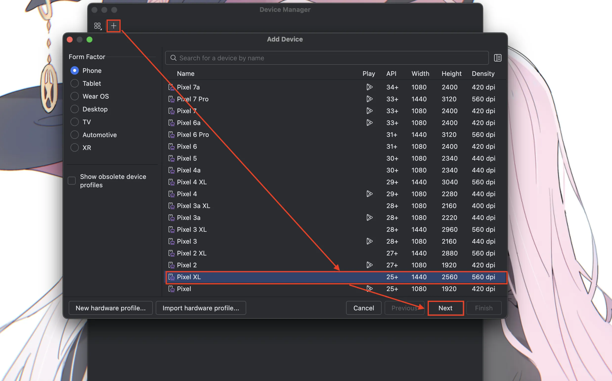
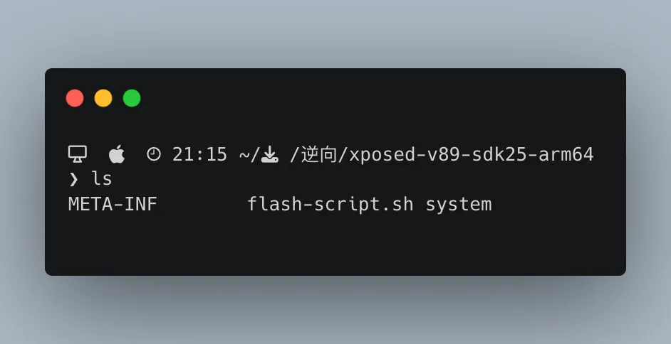
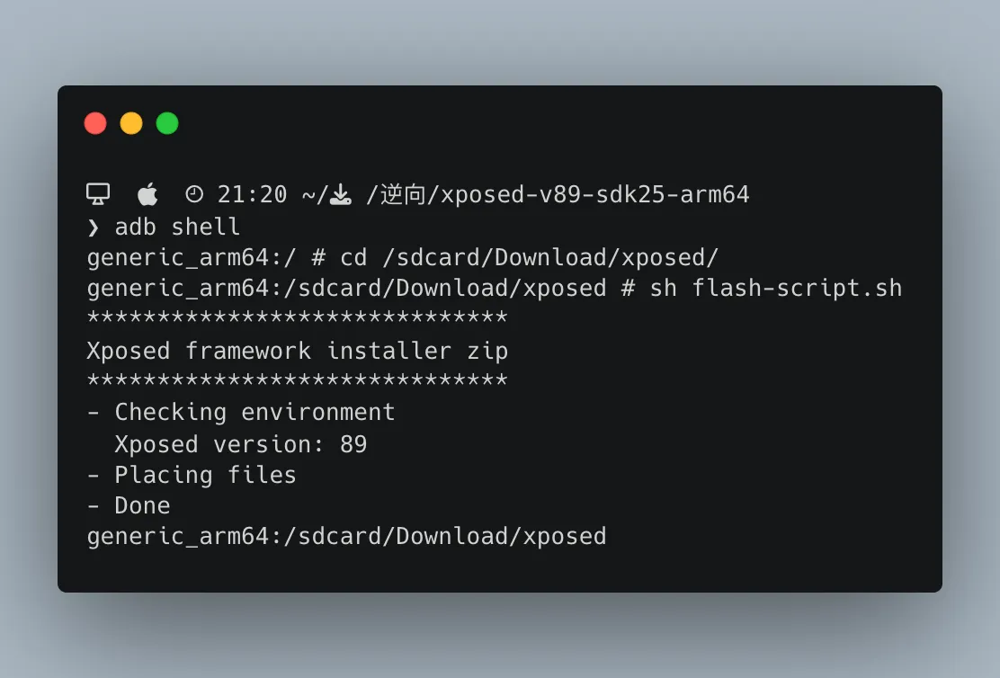

# Android 7.1.1 AVD 上安装与激活 Xposed 框架

在进行 Xposed 模块开发时，我们有时需要对某些应用进行逆向分析。对于加壳应用，常用的方法是利用 Xposed 框架进行动态 Hook。无论加壳逻辑多么复杂，其 DEX 文件最终都会被加载到内存中。因此，我们可以通过 Xposed 提供的 Hook 机制，结合反射调用 `getDex()` 等方法，将内存中的 DEX 文件 dump 出来，从而进行进一步的逆向分析。

> **注意**：由于 Android 8 的 API 可能有所变化，基于这个方法的模块基本上只适用于 Android 7 及以下版本，而过低的安卓版本又会导致目标 APP 的兼容性问题。因此，我们选择在 Android Studio 中创建一个 Android 7.1.1 的 AVD，并在其上安装 Xposed 框架，以方便后续的逆向分析工作。
> 
> **如果没有特别提及，所有终端命令都是在宿主机上执行，如果有需要在 `adb shell` 中执行的会特别指出。**

## 目录

- [Android 7.1.1 AVD 上安装与激活 Xposed 框架](#android-711-avd-上安装与激活-xposed-框架)
  - [目录](#目录)
  - [1. 前置准备](#1-前置准备)
  - [2. 创建 AVD](#2-创建-avd)
    - [2.1. 打开 Virtual Device Manager](#21-打开-virtual-device-manager)
    - [2.2. 选择合适的 AVD](#22-选择合适的-avd)
    - [2.3. 选择合适的 Android API 版本](#23-选择合适的-android-api-版本)
  - [3. 配置 AVD 启动方式](#3-配置-avd-启动方式)
  - [4. `adb` 获取 `Root` 并挂载 `/system` 为可写](#4-adb-获取-root-并挂载-system-为可写)
  - [5. 安装 Xposed Installer](#5-安装-xposed-installer)
  - [6. 备份](#6-备份)
  - [7. 刷入 Xposed 框架](#7-刷入-xposed-框架)
    - [7.1. 解压 Xposed 框架压缩包](#71-解压-xposed-框架压缩包)
    - [7.2. 查看对比并修改 `flash-script.sh`](#72-查看对比并修改-flash-scriptsh)
    - [7.3. `push` 到 AVD 并执行](#73-push-到-avd-并执行)
  - [7.4. 重启 AVD](#74-重启-avd)

## 1. 前置准备

- Android Studio 及 SDK 环境
- `adb` 等必要工具（通常随 SDK 自带，无需额外配置）
- [Xposed 框架](https://archive.org/download/xposed-sdk25)
- [Xposed Installer APK](https://xdaforums.com/t/official-xposed-for-lollipop-marshmallow-nougat-oreo-v90-beta3-2018-01-29.3034811)

## 2. 创建 AVD

### 2.1. 打开 Virtual Device Manager
 


### 2.2. 选择合适的 AVD

Android 7 对应的 API 版本是 24 或者 25，我这里的 Pixel XL 和 Pixel 都是符合要求的，但是 GooglePlay 版本的 AVD 不支持 Root，因此我这里选择了 Pixel XL 作为目标设备。



### 2.3. 选择合适的 Android API 版本


等待下载完成后，你就可以在 Virtual Device Manager 中看到或者打开你创建的 AVD 了。此时，你就有了自己的一个 Android 测试环境了，如果不需要进行 Xposed 开发，那么到此为止就已经可以使用了。

## 3. 配置 AVD 启动方式

启动时需要以下几个注意事项：
1. DNS 需要修改为国内可用的 DNS，否则会导致网络问题。
2. 启动时需要启用 `-writable-system` 参数，否则无法修改 `/system` 分区。
3. 启动时需要启用 `-no-snapshot-load` 参数，否则软重启可能会让刷入 Xposed 变得更麻烦。
4. 启动时需要启用 `-selinux permissive` 参数，否则可能会导致 SELinux 安全问题。

平时可以如此在终端中启动：
```bash
cd $ANDROID_SDK_ROOT/sdk/emulator   # 视系统而定，总之进入 emulator 所在目录
./emulator -list-avds               # 查看可用的 AVD，如果自己记得住，也可以直接指定 AVD 名称
./emulator -avd $AVD_NAME -dns-server 223.5.5.5,223.6.6.6 -writable-system -no-snapshot-load -selinux permissive    # $AVD_NAME 需要替换成你自己的 AVD 名称
```

我平时习惯用命令行启动，因此写了一个 `start_avd.sh`，在加载 `~/.zshrc` 的时候会一同加载，以下提供代码可供参考：

```bash
# 用于增加 PATH 同时防止环境变量重复添加的函数
add_to_path() {
    for dir in "$@"; do
        if [[ -d "$dir" ]]; then
            if [[ ":$PATH:" != *":$dir:"* ]]; then
                export PATH="$dir:$PATH"
            echo "目录 $dir 被添加到 PATH 中"
            else
                echo "警告：目录 $dir 已经在 PATH 中"
            fi
        else 
            echo "错误：目录 $dir 不存在"
        fi
    done
}

# =======================
# Android SDK 路径
# =======================
export ANDROID_SDK_ROOT=$HOME/Library/Android/sdk   # 这个目录需要根据你自己的配置微调
add_to_path "$ANDROID_SDK_ROOT/cmdline-tools/latest/bin"
add_to_path "$ANDROID_SDK_ROOT/platform-tools"
add_to_path "$ANDROID_SDK_ROOT/emulator"

# =======================
# AVD 配置脚本
# =======================

# 设置默认 DNS
export ANDROID_DNS="223.5.5.5,223.6.6.6"

# 启动 AVD 的函数
start_avd() {
    local avds
    avds=$(emulator -list-avds)

    if [ -z "$avds" ]; then
        echo "未找到任何 AVD，请先创建。"
        return 1
    fi

    echo "可用的 AVD："
    local choices=()
    local i=1
    while IFS= read -r avd; do
        echo "[$i] $avd"
        choices[$i]="$avd"   # 用编号作为数组下标，避免错位
        ((i++))
    done <<< "$avds"

    echo -n "请输入要启动的编号："
    read -r choice

    if [[ "$choice" =~ ^[0-9]+$ ]] && [ -n "${choices[$choice]}" ]; then
        local selected="${choices[$choice]}"
        echo "正在启动 AVD: $selected ..."
        emulator -avd "$selected" -dns-server "$ANDROID_DNS" -writable-system -no-snapshot-load -selinux permissive
    else
        echo "无效选择。"
        return 1
    fi
}
```

在如此配置后，`source start_avd.sh` 后，你就可以在终端方便的通过 `start_avd` 启动 AVD 了。

随后启动 AVD，`adb` 就会自动连接到 AVD。此后的操作需要保证全程 AVD 都是启动状态。

## 4. `adb` 获取 `Root` 并挂载 `/system` 为可写

```bash
adb root
adb remount
```

如果目前为止没有错误的话，应该看到如下输出：


## 5. 安装 Xposed Installer

首先，使用 `adb install XposedInstaller_3.1.5.apk` 安装 Xposed Installer。

安装后，打开 Xposed Installer，应该会看到如下界面：


接下来需要进行激活 Xposed 框架。

## 6. 备份

> 备份非常重要！因为一不小心就可能覆盖错了文件导致 AVD 完全打不开。

```bash
cd ~/.android/avd           # 视安装位置而定
zip -r backup.zip $AVD_NAME # AVD_NAME 替换成自己的 AVD 名字
```

## 7. 刷入 Xposed 框架

### 7.1. 解压 Xposed 框架压缩包

```bash
cd ~/Downloads/逆向     # 视你的 Xposed 框架下载目录而定
unzip xposed-v89-sdk25-arm64.zip -d xposed-v89-sdk25-arm64  # 需要看自己的系统和架构应该安装什么版本的
```

### 7.2. 查看对比并修改 `flash-script.sh`

使用：
```bash
vim xposed-v89-sdk25-arm64/META-INF/com/google/android/flash-script.sh
```

查看 `flash-script.sh` 的内容并对比自己的 AVD 实际内容后，大概需要进行以下几个修改：
1. 由于我们已经进行过了 `adb remount`，所以不需要再进行 `mount -o remount,rw /system`，当然，理论上如果要进行 `mount -o remount,rw /system` 也是可以的，但是实测会出现一些问题，具体原因我没有深入研究，所以这里直接省略了。
2. 由于我使用的 AVD 是 arm64 的，因此有一些目录和文件是不存在的，例如不存在 `/system/lib32` 目录，需要进行适当的修改。


修改后的 `flash-script.sh` 如下：
```bash
##########################################################################################
#
# Xposed framework installer zip.
#
# This script installs the Xposed framework files to the system partition.
# The Xposed Installer app is needed as well to manage the installed modules.
#
##########################################################################################

grep_prop() {
  REGEX="s/^$1=//p"
  shift
  FILES=$@
  if [ -z "$FILES" ]; then
    FILES='/system/build.prop'
  fi
  cat $FILES 2>/dev/null | sed -n $REGEX | head -n 1
}

android_version() {
  case $1 in
    15) echo '4.0 / SDK'$1;;
    16) echo '4.1 / SDK'$1;;
    17) echo '4.2 / SDK'$1;;
    18) echo '4.3 / SDK'$1;;
    19) echo '4.4 / SDK'$1;;
    21) echo '5.0 / SDK'$1;;
    22) echo '5.1 / SDK'$1;;
    23) echo '6.0 / SDK'$1;;
    24) echo '7.0 / SDK'$1;;
    25) echo '7.1 / SDK'$1;;
    26) echo '8.0 / SDK'$1;;
    27) echo '8.1 / SDK'$1;;
    *)  echo 'SDK'$1;;
  esac
}

cp_perm() {
  cp -f $1 $2 || exit 1
  set_perm $2 $3 $4 $5 $6
}

set_perm() {
  chown $2:$3 $1 || exit 1
  chmod $4 $1 || exit 1
  if [ "$5" ]; then
    chcon $5 $1 2>/dev/null
  else
    chcon 'u:object_r:system_file:s0' $1 2>/dev/null
  fi
}

install_nobackup() {
  cp_perm ./$1 $1 $2 $3 $4 $5
}

install_and_link() {
  TARGET=$1
  XPOSED="${1}_xposed"
  BACKUP="${1}_original"
  if [ ! -f ./$XPOSED ]; then
    return
  fi
  cp_perm ./$XPOSED $XPOSED $2 $3 $4 $5
  if [ ! -f $BACKUP ]; then
    mv $TARGET $BACKUP || exit 1
    ln -s $XPOSED $TARGET || exit 1
    chcon -h 'u:object_r:system_file:s0' $TARGET 2>/dev/null
  fi
}

install_overwrite() {
  TARGET=$1
  if [ ! -f ./$TARGET ]; then
    return
  fi
  BACKUP="${1}.orig"
  NO_ORIG="${1}.no_orig"
  if [ ! -f $TARGET ]; then
    touch $NO_ORIG || exit 1
    set_perm $NO_ORIG 0 0 600
  elif [ -f $BACKUP ]; then
    rm -f $TARGET
    gzip $BACKUP || exit 1
    set_perm "${BACKUP}.gz" 0 0 600
  elif [ ! -f "${BACKUP}.gz" -a ! -f $NO_ORIG ]; then
    mv $TARGET $BACKUP || exit 1
    gzip $BACKUP || exit 1
    set_perm "${BACKUP}.gz" 0 0 600
  fi
  cp_perm ./$TARGET $TARGET $2 $3 $4 $5
}

##########################################################################################

echo "******************************"
echo "Xposed framework installer zip"
echo "******************************"

if [ ! -f "system/xposed.prop" ]; then
  echo "! Failed: Extracted file system/xposed.prop not found!"
  exit 1
fi

echo "- Checking environment"
API=$(grep_prop ro.build.version.sdk)
APINAME=$(android_version $API)
ABI=$(grep_prop ro.product.cpu.abi | cut -c-3)
ABI2=$(grep_prop ro.product.cpu.abi2 | cut -c-3)
ABILONG=$(grep_prop ro.product.cpu.abi)

XVERSION=$(grep_prop version system/xposed.prop)
XARCH=$(grep_prop arch system/xposed.prop)
XMINSDK=$(grep_prop minsdk system/xposed.prop)
XMAXSDK=$(grep_prop maxsdk system/xposed.prop)

XEXPECTEDSDK=$(android_version $XMINSDK)
if [ "$XMINSDK" != "$XMAXSDK" ]; then
  XEXPECTEDSDK=$XEXPECTEDSDK' - '$(android_version $XMAXSDK)
fi

ARCH=arm
IS64BIT=
if [ "$ABI" = "x86" ]; then ARCH=x86; fi;
if [ "$ABI2" = "x86" ]; then ARCH=x86; fi;
if [ "$API" -ge "21" ]; then
  if [ "$ABILONG" = "arm64-v8a" ]; then ARCH=arm64; IS64BIT=1; fi;
  if [ "$ABILONG" = "x86_64" ]; then ARCH=x64; IS64BIT=1; fi;
fi

# echo "DBG [$API] [$ABI] [$ABI2] [$ABILONG] [$ARCH] [$XARCH] [$XMINSDK] [$XMAXSDK] [$XVERSION]"

echo "  Xposed version: $XVERSION"

XVALID=
if [ "$ARCH" = "$XARCH" ]; then
  if [ "$API" -ge "$XMINSDK" ]; then
    if [ "$API" -le "$XMAXSDK" ]; then
      XVALID=1
    else
      echo "! Wrong Android version: $APINAME"
      echo "! This file is for: $XEXPECTEDSDK"
    fi
  else
    echo "! Wrong Android version: $APINAME"
    echo "! This file is for: $XEXPECTEDSDK"
  fi
else
  echo "! Wrong platform: $ARCH"
  echo "! This file is for: $XARCH"
fi

if [ -z $XVALID ]; then
  echo "! Please download the correct package"
  echo "! for your platform/ROM!"
  exit 1
fi

echo "- Placing files"
install_nobackup /system/xposed.prop                      0    0 0644
install_nobackup /system/framework/XposedBridge.jar       0    0 0644

install_overwrite /system/bin/dex2oat                     0 2000 0755 u:object_r:dex2oat_exec:s0
install_overwrite /system/bin/oatdump                     0 2000 0755
install_overwrite /system/bin/patchoat                    0 2000 0755 u:object_r:dex2oat_exec:s0

if [ $IS64BIT ]; then
  install_and_link  /system/bin/app_process64             0 2000 0755 u:object_r:zygote_exec:s0
  install_overwrite /system/lib64/libart.so               0    0 0644
  install_overwrite /system/lib64/libart-compiler.so      0    0 0644
  install_overwrite /system/lib64/libart-disassembler.so  0    0 0644
  install_overwrite /system/lib64/libsigchain.so          0    0 0644
  install_nobackup  /system/lib64/libxposed_art.so        0    0 0644
fi

if [ "$API" -ge "22" ]; then
  find /system /vendor -type f -name '*.odex.gz' 2>/dev/null | while read f; do mv "$f" "$f.xposed"; done
fi

echo "- Done"
exit 0
```

### 7.3. `push` 到 AVD 并执行

首先把 `flash-script.sh` 拷贝到 `xposed-v89-sdk25-arm64` 目录。
```bash
mv META-INF/com/google/android/flash-script.sh ./
```

此时使用 `ls` 应该能看到如下结果：



随后将 `xposed-v89-sdk25-arm64` 目录推送到 AVD 中：
```bash
adb push ./ /sdcard/Download/xposed
```

进入 `adb shell` 并在 `/sdcard/Download/xposed` 目录下执行 `flash-script.sh`：
>

此时打开 `Xposed Installer` 应该能看到如下结果：


> 如果这个时候很久都发现动不了，基本上是覆盖了不该覆盖的文件，这个时候只能恢复备份的文件了。
>
> 此时按理说应该在 `adb shell` 中继续执行 `sync` 以确保文件同步到 AVD 中，但实际操作中并未发现需要执行 `sync`，不过建议还是执行一下。
 
## 7.4. 重启 AVD

执行 `adb reboot` 重启 AVD，重启后打开 `Xposed Installer` 应该能看到如下结果：


如果出现了这个界面，说明 Xposed 框架已经安装成功。
